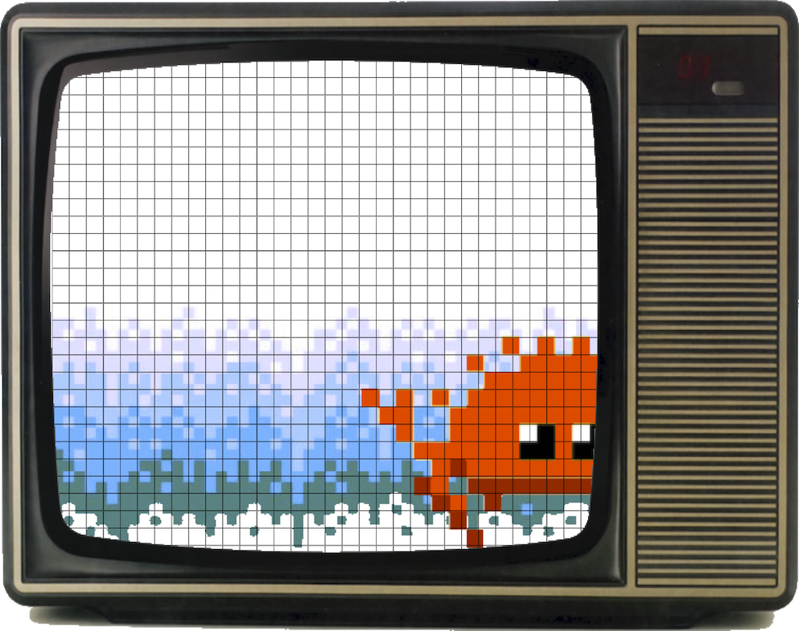

# Afterword

<table style="width:100%; border: none;"> 
<tr>
<td style="width:50%; border: none; padding: 0; ">Hey there! I’m Rafael Bagmanov, software developer from NYC.  I write in Scala, Rust and Clojure. I usually work on data-crunching software in the coal mines of backend engineering.   And I’m a big fan of distributed systems, data-intensive apps, and functional programming. 

You can find more about me on:
* [Twitter](https://twitter.com/bugzmanov) 
* [Github](https://github.com/bugzmanov/)
* [LinkedIn](https://www.linkedin.com/in/bugzmanov/)
</td>
<td style="widht:50%; border: none; padding: 0;"> </td>
</tr>

</table>

<table style="width:100%"> 
<tr>
<td style="width:40%; border: none;">   </td>
<td style="widht:70%; border: none;">   I hope you've enjoyed the read and had a great time.   Emulating old hardware is so much fun. Those systems were designed to be read, understood and modified by humans. And despite being very low-level, you don't need ten layers of abstraction to get it and see it working. And that's amazing.  Until next time!</td>
</tr>
</table>

Hey there! I’m Rafael Bagmanov, software developer from NYC.  I write in Scala, Rust, and Clojure. I usually work on data-crunching software in the coal mines of backend engineering.   And I’m a big fan of distributed systems, data-intensive apps, and functional programming. 

You can find more about me on:
* [Twitter](https://twitter.com/bugzmanov) 
* [GitHub](https://github.com/bugzmanov/)
* [LinkedIn](https://www.linkedin.com/in/bugzmanov/)

I hope you've enjoyed the read and had a great time.   Emulating old hardware is so much fun. Those systems were designed to be read, understood, and modified by humans. And despite being very low-level, you don't need ten layers of abstraction to get it and see it working. And that's amazing.  Until next time!

