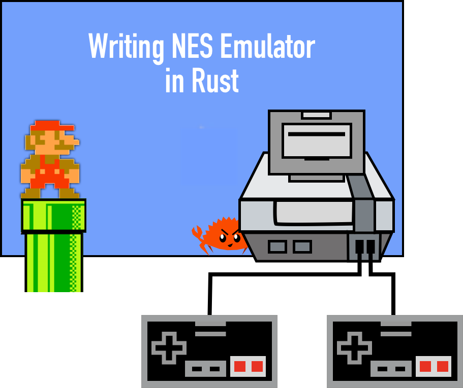

# Why NES? 

NES was one of the most popular gaming platforms through the 80ies and the 90ies. The platform and the emergent ecosystem was and still is a huge cultural phenomenon. The device itself had relatively simple hardware  (judging from the modern days)  and it's amazing how much was made out of it. 

This series is about creating an emulator that would be capable of running and playing first-gen NES games, like 
- [PacMan](https://en.wikipedia.org/wiki/Pac-Man)
- [Donkey Kong](https://en.wikipedia.org/wiki/Donkey_Kong)
- [Ice Climber](https://en.wikipedia.org/wiki/Ice_Climber)
- [Mario Super Bros](https://en.wikipedia.org/wiki/Super_Mario_Bros)
- etc

Through the series we would go with incremental updates, with the milestones that are potentially enjoyable, gradually building a fully capable platform. One of the problems in writing an emulator is that you can't get any feedback until the very end. Until the whole thing is done. And that's no fun. I've tried to break the whole exercise into small pieces with visible and playable goals. After all, it's all about having a good time. 

# Why Rust? 

Rust is a modern language with modern expressing capabilities and pretty awesome performance characteristics. 

> For an overview of the language I recommend watching ["Consider Rust"](https://www.youtube.com/watch?v=DnT-LUQgc7s) presentation by Jon Gjengse

The language allows us to go as low-level as needed in terms of hardware and memory manipulation. Which looks like a good fit to the problem of hardware simulation. For example, NES has a Central Processing Unit, and the majority of supported operations are dealing with unsigned 8bit arithmetic and bits manipulation. Rust provides awesome capabilities of working with signed and unsigned numbers of different sizes without any overhead. And Rust ecosystem offers multiple libraries that make working on bit-level data as convenient as it gets. 

Our goal is to run NES games on a hardware we have, meaning we have to simulate NES hardware. That alone implies that we are introducing significant performance overhead in comparison to running native applications. 
By choosing rust we are hoping to get some additional performance budget that can be used for our extra needs. NES hardware specs are pretty modest in today's standards. For example, the NES CPU is about 3000 times slower than modern CPUs. Emulating that in any language should not be a problem. Some folks were able to get playable performance on an emulator written in python. But it is still nice to have extra power for free. 

# Prerequisites

It's assumed that the reader has basic knowledge of rust language, understanding main language constructs and platform capabilities. Some of the features would be introduced as we go, but others should be learned elsewhere.

It's also assumed that the reader has a basic understanding of bit arithmetic, boolean logic and binary systems. Again NES is a relatively simple platform and the NES CPU instructions set is small and straightforward, but some basic understanding of computer systems is required. 

