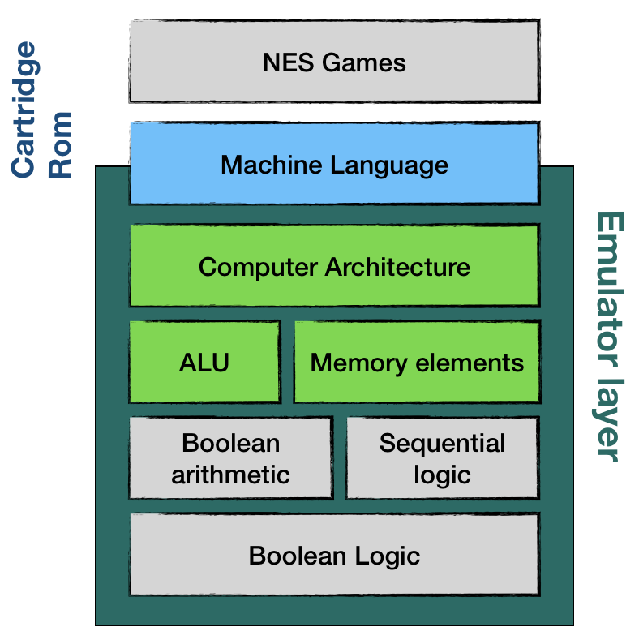
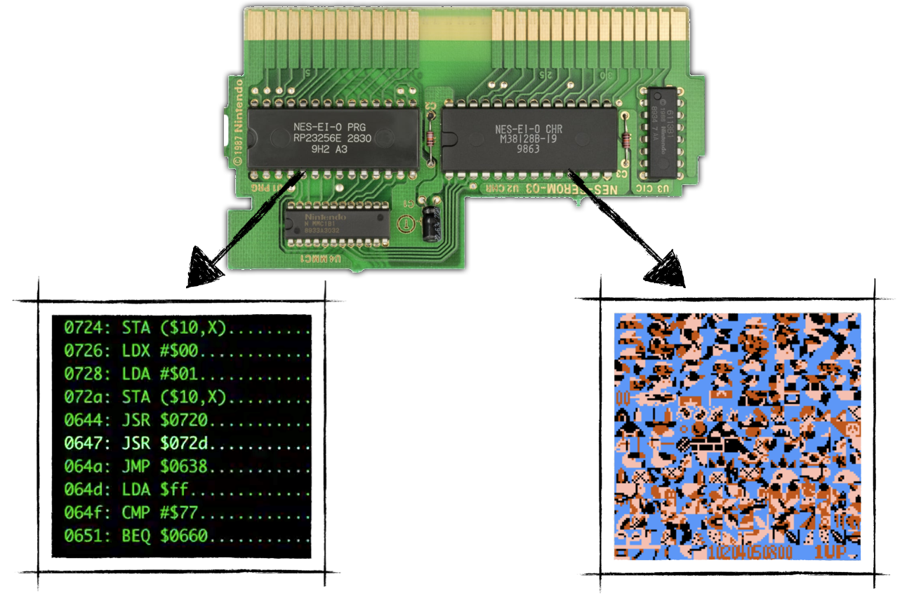
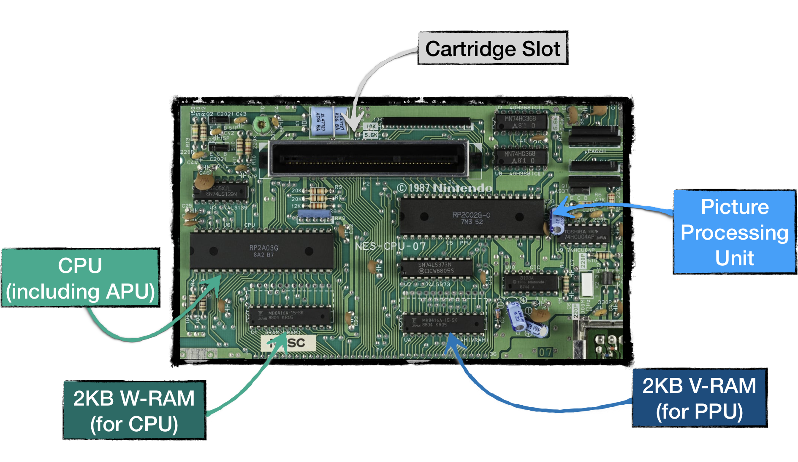

# Understanding the NES Platform
## Achitecture

The simplified architecture of hardware-software interactions looks like this:

From top to bottom: 
* applications are running business logic and interact with hardware through an Operating System. 
* An Operating System is communicating with hardware using machine language. <TODO: assembly lang>
* On a hardware level, each device can be seen as memory elements or processing unit or both (for instance, from this perspective NES joypad is nothing more than an array of boolean items that represents buttons in either pressed or released state) 
* Next levels down the stack are less of an interest to us. In the end, it all comes to logic gates and their arrangements. 

> If you want to get intimate knowledge of how computers are composed, starting from basic principles of boolean logic I highly recommend the book "The Elements of Computing Systems Building a Modern Computer from First Principles by Noam Nisan, Shimon Schocken."

Luckily for us, NES doesn't have an Operating System. That means that the Application layer (Gamezzz) communicates with hardware directly, still using machine language.

The symplified version of this layered architecture looks like this:

As you can see the machine language as an interface between our emulator and  NES games.

In the coming emulator, we would need to implement NES Computer Architecture, Arithmetic Logic Unit, and Memory. We would try using existing Rust features and language constructs to execute low-level boolean logic and arithmetic. 

## NES Platform Main Components

This is a significantly simplified schema of main NES hardware components. 

 * Central Processing Unit (**CPU**) is a modified version of 6502 chip (https://en.wikipedia.org/wiki/MOS_Technology_6502) - 2A03. As with any CPU, the goal of this module is to execute the main program instructions. 

* Picture Processing Unit (**PPU**) - was based on chip 2C02 made by the same company that made CPU - Ricoh. This module's main goal is to draw the current state of a game on a TV Screen. 

* Both CPU and PPU have access to their 2KB banks of Random Access Memory (**RAM**)

* Audio Processing Unit (**APU**) - the module is a part of 2A03 chip and is responsible for generating specific five-channel based sounds, that made NES chiptunes so recognizable.

* Cartridges - were an essential part of the platform, mainly because the console didn't have an operating system. Each cartridge carried at least two large ROM chips - Character Rom (CHR Rom) and Program Rom (PRG Rom). The former stores' video graphics data of a game, the latter stored the CPU instructions - code of a game. 
(in reality, when a cartridge is inserted into the slot CHR Rom is connected directly to PPU, while PRG Rom is connected directly to CPU)
The later version of cartridges carried additional hardware (ROM and RAM) accessible through so-called mappers. That explains why later games had provided significantly better gameplay and visuals despite running on the same console hardware. 

* Gamepads - have a distinct goal to read inputs from a gamer and make it available for game logic. As we will learn, later on, the fact that the gamepad for the 8bit platform had only eight buttons is not a coincidence. 

What's interesting is that CPU, PPU, and APU are independent of each other. This fact makes NES a distributed system in which separate components have to coordinate to generate one seamless gaming experience.

The schema of the main NES components naturally defines the implementation plan for our emulator. 

We would be building a simulation of all of these modules. The goal is to have something playable as soon as possible. We would use an iterative approach to development, and on each cycle would try to implement the minimal amount of features to achieve the goal. Writing an emulator is a never-ending quest. But this quest has a start. And we will start by emulating the CPU.

