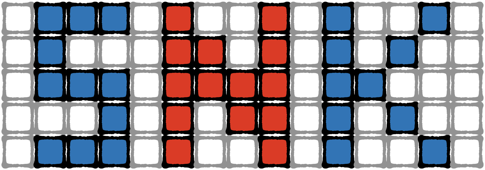
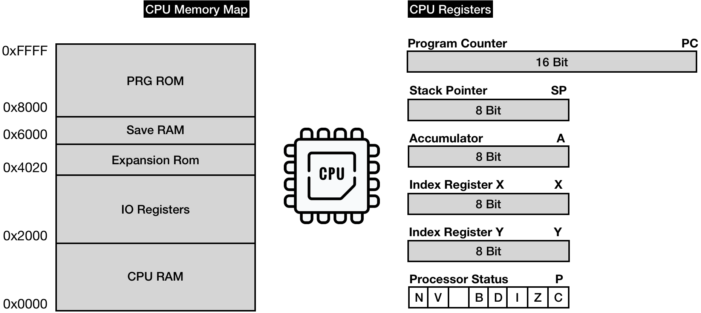
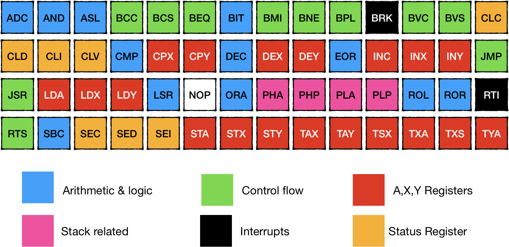

 # Emulating CPU

The goal of this chapter is to have our first NES game up and running. 
We are going to play Snake game, whose source code can be found here: https://gist.github.com/wkjagt/9043907.

 

 

CPU is the heart of any computer system. It's the CPUs job to run program instructions and orchestrate all available modules and hardware to provide a gamer the full experience. Despite PPU and APU running their independent circuits, they still need to execute commands issued by the CPU. 

Before jumping into implementation, we need to briefly discuss which resources are available to the CPU to do its work.

The only two resources the CPU has access to are Memory and Cpu Registers. 

From a programming standpoint, memory is just a continuous array of 1-byte cells. NES Cpu uses 16bit memory addressing, which means that the CPU can address 65536 different memory cells. 

As we've seen before, the NES had only 2KB of Ram dedicated to the CPU. 

 

That Ram is accessible via **[0x0000 … 0x2000]** address space. 

Access to **[0x2000 … 0x4020]** is redirected to other available NES hardware modules: PPU, APU, GamePads, etc. (more on this later)

Access to **[0x4020 .. 0x6000]** is a special space that different generations of cartridges use differently. It might be mapped to nothing at all, RAM, ROM, etc

Access to **[0x6000 .. 0x8000]** is reserved to Ram on a cartridge if a cartridge has one. It was used in games like Zelda for storing and retrieving the game state.

Access to **[0x8000 … 0x10000]** is redirected to Program Rom (PRG ROM) space on a cartridge. 

But because memory access is relatively slow, NES CPU has a few memory slots called registers with significantly lower access delay. 

> | Cpu Operation type  | Execution time (CPU Cycles)  |
> |---|---|
> | Just register access                         | 2        | 
> | Accessing first 255 bytes of RAM             | 3        |
> | Accessing memory after the first 255         | 4-7  |

NES Cpu has 7 Registers:
* Program Counter - holds the address for the next machine language instruction to be executed
* Stack Pointer - Memory space [0x0100 .. 0x1FF] is used for stack. The stack pointer holds the address of the top of the stack. NES Stack (as all stacks) grows from top to bottom: when a byte worth of data pushed to the stack - SP register decrements  and when an item is popped out of the stack the - SP register increments

* Accumulator (A) - stores results of arithmetic, logic and memory access operations

* Index Register X (X) - used as an offset in specific memory addressing modes. Can be used for auxiliary needs (holding temp values, being used as a counter, etc.)

* Index Register Y (Y) -  similar use cases as with register X.

* Processor status (P) - 8bit register represents 7 status flags that can be set or cleared depending on the result of the operation ( for example Z flag is set if the result of an executed instruction is 0, and is cleared otherwise)

Each CPU comes with a predefined hard-wired instruction set that defines everything a CPU can do.

CPU receives instructions from the application layer in the form of machine codes. And you can think of machine language as a thin interface between hardware and software. 

A full list of the official 6502 instruction set can be found :
* http://www.obelisk.me.uk/6502/reference.html
* http://www.6502.org/tutorials/6502opcodes.html

Those pages provide full specs of available CPU features and their machine codes. 

I highly recommend reading an interactive tutorial on the 6502 instructions set here before moving on https://skilldrick.github.io/easy6502/.

 

6502 chip is a relatively simple CPU; it supports only six types of commands and about 64 unique commands. Because some of the instructions have multiple versions (for different memory addressing modes), it results in about 150 machine code operations that we are to implement. 

**NOTE:** NES had a custom chip 2A03 based on 6502 chip, but had noticeable differences:
>
> - in addition to official machine operations, it had about 110 unofficial additional ops codes (luckily, about a third of them are No-OPs)
> - it had Audio Processing Unit on board
> - it didn't support decimal mode for arithmetic
>
> To keep things simple, we would need to implement support for 256 different machine instructions in the end. 
>
>The good news is that there are a lot of similarities between instructions. Once we have the foundation in place, we would constantly be re-using it to implement the whole set.
