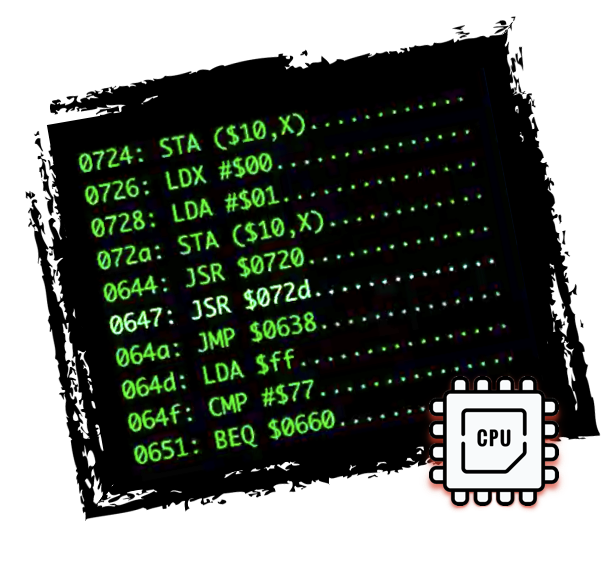
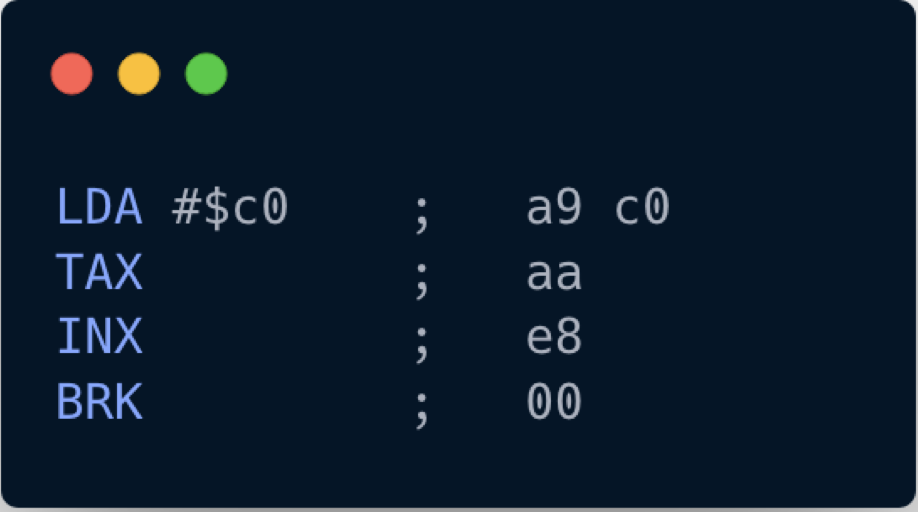

# Let's get started.

 <div style="text-align:center"></div>

Let's try to interpret to execute our first program. It looks like this:


```
a9 c0 aa e8 00
```

This is somewhat cryptic and isn't designed to be interpreted by humans. But we can more easily decipher what's going on if we represent those codes in mnemonics based language - assembler.  

<div style="text-align:center"></div>

So our program consists of 4 instructions, and the first one has a parameter.

Let's try to interpret what's going on using ops code specifications: [6502 Instruction Reference](http://www.obelisk.me.uk/6502/reference.htm)

<div style="text-align:center"></div>

It looks like that the command loads a hexadecimal value 0xC0 into the accumulator CPU register. And it also has to update some bits in Processor Status register P (namely, bit 1 - Zero Flag and bit 7 - Negative Flag). 


> By looking at the LDA spec, we can also deduce that the ops code 0xA9 has one parameter: the instruction size is 2 Bytes: one byte is for operation code itself(standard for all NES CPU opcodes), and the other is for a parameter. 
>
> NES Opscodes can have no explicit parameters or one explicit parameter. For some operations, the explicit parameter can take 2 bytes. And the whole instruction would occupy 3 bytes.
> 
> Also, some of the operations use CPU registers as implicit parameters.  

Let's try to sketch out how our CPU might look like from a high-level perspective:

```rust
pub struct CPU {
   pub register_a: u8,
   pub status: u8,
   pub program_counter: u16,
}
 
impl CPU {
   pub fn new() -> Self {
       CPU {
           register_a: 0,
           status: 0,
           program_counter: 0,
       }
   }
 
   pub fn interpret(&mut self, program: Vec<u8>) {
       todo!("")
   }
}
```

We also introduced a program counter register that would help us track our current position in the program. Note that the interpret method takes a mutable reference to self as we know that we would need to modify **register_a** during the execution.

CPU works in a constant cycle:
* Fetch next execution instruction from the instruction memory
* Decode the instruction
* Execute the Instruction
* Repeat the cycle

Lets try to codify exactly that:

```rust 
pub fn interpret(&mut self, program: Vec<u8>) {
    self.program_counter = 0;

    loop {
        let opscode = program[self.program_counter as usize];
        self.program_counter += 1;

        match opscode {
            _ => todo!()
        }
    }
}
```

So far so good. Endless loop? Nah, it's gonna be alright. Now let's implement the LDA (0xA9) ops code:

```rust
        match opscode {
            0xA9 => {
                let param = program[self.program_counter as usize];
                self.program_counter +=1;
                self.register_a = param;

                if result == 0 {
                    self.status = self.status | 0b0000_0001;
                } else {
                    self.status = self.status & 0b1111_1110;
                }

                if result & 0b1000_0000 != 0 {
                    self.status = self.status | 0b1000_0000;
                } else {
                    self.status = self.status & 0b0111_1111;
                }

            }
            _ => todo!()
        }
```

We are not doing anything crazy here, just what was specified in LDA spec. Also, we are fully utilizing existing rust lang features for boolean arithmetic. 

> Note: it's essential to set and also erase CPU flag status depending on the results

Because of the endless loop, we won't be able to test this functionality yet. Before moving on, let's quickly implement **BRK (0x00)** ops code:

```rust
        match opcode {
        // ...
            0x00 => {
                return;
            }
            _ => todo!()
        }
```

Now we can write some tests:


```rust
#[cfg(test)]
mod test {
   use super::*;
 
   #[test]
   fn test_0xa9_lda_immidiate_load_data() {
       let mut cpu = CPU::new();
       cpu.interpret(vec![0xa9, 0x05, 0x00]);
       assert_eq!(cpu.register_a, 0x05);
       assert!(cpu.status & 0b0000_0001 == 0);
       assert!(cpu.status & 0b1000_0000 == 0);
   }
}
```

> Do you think that's enough? What else should we check? 

Alright. Let's try to implement another opcode? 

<div style="text-align:center"></div>

This one is also really straightforward: copy a value from A to X.

We need to introduce **register_x** in our CPU struct, and then we can implement the **TAX (0xAA)** opcode:

```rust
pub struct CPU {
//...
   pub register_x: u8,
}
 
impl CPU {
// ...    
    pub fn interpret(&mut self, program: Vec<u8>) {
// ...
        match opscode {
            //...  
            0xAA =>  {
                self.register_x = self.register_a;
            
                if result == 0 {
                    self.status = self.status | 0b0000_0001;
                } else {
                    self.status = self.status & 0b1111_1110;
                }

                if result & 0b1000_0000 != 0 {
                    self.status = self.status | 0b1000_0000;
                } else {
                    self.status = self.status & 0b0111_1111;
                }

            }
        }
    }
}
```

And don't forget to write tests:


```rust 
   #[test]
   fn test_0xaa_tax_move_a_to_x() {
       let mut cpu = CPU::new();
       cpu.register_a = 10;
       cpu.interpret(vec![0xaa, 0x00]);
 
       assert_eq!(cpu.register_x, 10)
   }
```

Before moving to the next opcode, we have to admit that our code becomes quite convoluted:
* interpret method is already quite complicated and does multiple things
* there is quite a bit of duplication between the way TAX and LDA are implemented.

Let's fix that: 

```rust 
// ... 
  fn lda(&mut self, value: u8) {
       self.register_a = value;
       self.update_zero_and_negative_flags(self.register_a);
   }
 
   fn tax(&mut self) {
       self.register_x = self.register_a;
       self.update_zero_and_negative_flags(self.register_x);
   }
  
    fn update_zero_and_negative_flags(&mut self, result: u8) {
        if result == 0 {
            self.status = self.status | 0b0000_0001;
        } else {
            self.status = self.status & 0b1111_1110;
        }

        if result & 0b1000_0000 != 0 {
            self.status = self.status | 0b1000_0000;
        } else {
            self.status = self.status & 0b0111_1111;
        }
    }
// ...    
    pub fn interpret(&mut self, program: Vec<u8>) {
// ...
        match opscode {
            0xA9 => {
                let param = program[self.program_counter as usize];
                self.program_counter += 1;
                
                self.lda(param);
            }

            0xAA => self.tax(),

            0x00 => return,
            
            _ => todo!(),
        }
    }
}
```

Ok. Looks more manageable now. And hopefully, all tests are still passing. 

I cannot emphasize enough the importance of writing tests for all ops codes we are implementing. The operations themselves are almost trivial, but tiny accidental mistakes will unpredictably ripple a game logic.

<div style="text-align:center"></div>

Implementing that last opcode from the program should not be a problem, and I'll leave this exercise to you. 

At the end the following test should be passing: 

```rust 
   #[test]
   fn test_5_ops_working_together() {
       let mut cpu = CPU::new();
       cpu.interpret(vec![0xa9, 0xc0, 0xaa, 0xe8, 0x00]);
 
       assert_eq!(cpu.register_x, 0xc1)
   }

    #[test]
    fn test_inx_overflow() {
        let mut cpu = CPU::new();
        cpu.register_x = 0xff;
        cpu.interpret(vec![0xe8, 0xe8, 0x00]);

        assert_eq!(cpu.register_x, 1)
    }


```