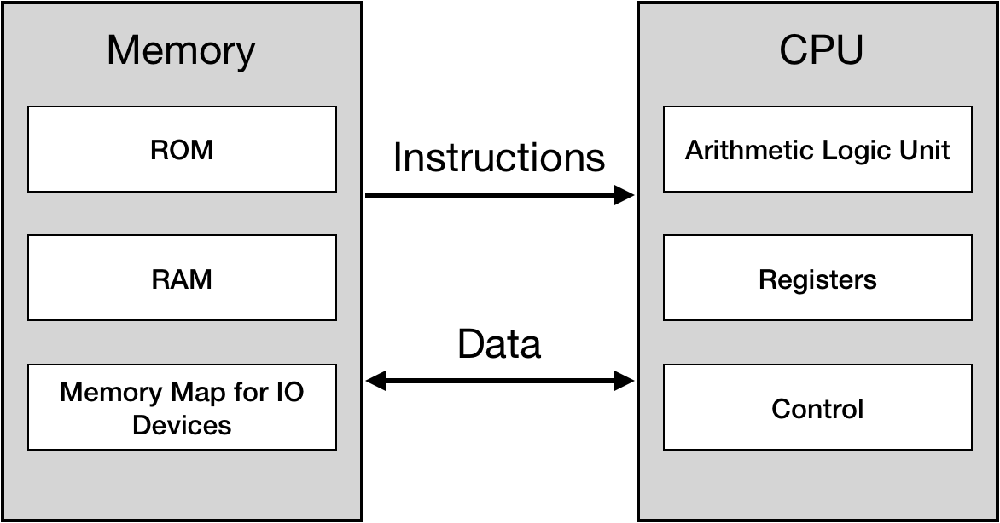

# Memory addressing modes

On our initial implementation CPU receives instructions as separate input stream. Which is not how the things actually work.

NES implements typical von Neumann architecture: computer memory stores both data and the instructions that needs to be executed by the machine. From CPU perspective execution code is data and any data can potentially be interpreted as and execution code. There is no way CPU can tell the difference between data that is code and data that is uhm… data. The only mechanism CPU has is a **program_counter** register that keeps track of a position in instructions stream.

 <div style="text-align:center"></div>

Lets try to sketch this out in our CPU code:

```rust

pub struct CPU {
   pub register_a: u8,
   pub register_x: u8,
   pub status: u8,
   pub program_counter: u16,
   memory: [u8; 0xFFFF]
}
 
impl CPU {
 
    fn mem_read(&self, addr: u16) -> u8 {
        self.memory[addr as usize]
    }

    fn mem_write(&mut self, addr: u16, data: u8) {
        self.memory[addr as usize] = data;
    }

    pub fn load_and_run(&mut self, program: Vec<u8>) {
        self.load(program);
        self.run()
    }

    pub fn load(&mut self, program: Vec<u8>) {
        self.memory[0x8000 .. (0x8000 + program.len())].copy_from_slice(&program[..]);
        self.program_counter = 0x8000;
    }
 
    pub fn run(&mut self) {
    // note: we move  intialization of program_counter from here to load function
        loop {
            let opscode = self.mem_read(self.program_counter);
            self.program_counter += 1;

            match opscode {
                //..
            }
        }
    }
}

```


For now, we just created an array for the whole 64 KiB worth of address space. But as discusses in <LINK TO A CHAPTER>, CPU has only 2 KiB of RAM, everything else is reserved for memory mapping. 

We also load program code into memory from 0x8000 address. In reallity, this is were Cartridge ROM memory map starts, so we can assume that instructions stream would start somewhere in this space [0x8000 .. 0xFFFF] but not necessarily at exact 0x8000.

In fact, NES platform has a special mechanism to notify where should CPU start the execution - upon inserting a new cartridge the CPU received special signal called "Reset interrrupt" that instructs CPU to:
* reset all state (registers and flags)
* set **program_counter** to the 16bit address that is stored at 0xFFFC

Before implementing that, I should briefly mention that NES Cpu can address 65536 memory cells, that mean that memory addresses can take 2 Bytes. NES CPU uses Little-Endian addressing rather than big-endian.
That means that 8 liest significant bits of address will be stored before 8 most significant bit. 

The difference can be illustrated like this:


| |  |
|-|-:|
| Real Address | **0x8000** |
| Address packed in big endian | **80 00** |
|Address packed in little endian | **00 80** |


For example, instruction to read data from memory cell 0x8000 into A register would look like:

```
LDA $8000      <=>    ad 00 80
```

Let's implement this behaviour:


```rust
   fn mem_read_u16(&mut self, pos: u16) -> u16 {
       let lo = self.mem_read(pos) as u16;
       let hi = self.mem_read(pos + 1) as u16;
       (hi << 8) | (lo as u16)
   }
 
   fn mem_write_u16(&mut self, pos: u16, data: u16) {
       let hi = (data >> 8) as u8;
       let lo = (data & 0xff) as u8;
       self.mem_write(pos, lo);
       self.mem_write(pos + 1, hi);
   }

```


Now we can try implement **reset** functionallity properly. We would also have to adjust load and load_and_run:
* **load** method should load program into PRG Rom space and save the reference to the code into 0xFFFC memory cell
* **reset** method should restore state of all registers, and initialize program_counter by the 2 byte value stored at 0xFFFC


```rust
   pub fn reset(&mut self) {
       self.register_a = 0;
       self.register_x = 0;
       self.status = 0;
 
       self.program_counter = self.mem_read_u16(0xFFFC);
   }
 
   pub fn load(&mut self, program: Vec<u8>) {
       self.memory[0x8000 .. (0x8000 + program.len())].copy_from_slice(&program[..]);
       self.mem_write_u16(0xFFFC, 0x8000);
   }
 
   pub fn load_and_run(&mut self, program: Vec<u8>) {
       self.load(program);
       self.reset();
       self.run()
   }

```

Don't forget to fix failing tests now **:trollface:**

Alright that was the easy part. 

Remember LDA  opscode we've implemented last chapter? That single mnemonic (LDA) actually can be traslated into 8 different machine instructions depending on a type of the parameter:


 <div style="text-align:center"></div>

You can read about addressing modes: 
- [here](https://skilldrick.github.io/easy6502/#addressing)
- and [here](www.obelisk.me.uk/6502/addressing.html)

In short, the addressing mode is a property of an instruction that defines how CPU would interpret next 1 or 2 bytes in the instruction stream. 

It's important to note that different addressing modes have different instruction sizes. 
For example, 
- **Zero Page version** ($A5) has size of 2 bytes - one for opcode itself, and one for parameter. That's why zero page addressing can't reference memory above first 255 bytes.
- **Absolute version** ($AD) has 3 bytes - that means that the address occopies 2 bytes, which makes it possible to reference all of 65536 memory cells, as we've discussed.
(*NOTE: 2 byte the parameter will be packed according to little-endian rules*)

There are no opcodes that occupies more than 3 bytes. Opcode instruction can have a size: 1 byte, 2 bytes, 3 bytes. 

One important details is that majority of CPU instructions provide more than 1 addressing alternative. Ideally we don't want to re-implement the same addressing mode logic for every CPU instruction.


Let's try to codify how CPU should interpret different addressing modes:

```rust

#[derive(Debug)]
#[allow(non_camel_case_types)]
pub enum AddressingMode {
   Immediate,
   ZeroPage,
   ZeroPage_X,
   ZeroPage_Y,
   Absolute,
   Absolute_X,
   Absolute_Y,
   Indirect_X,
   Indirect_Y,
   NoneAddressing,
}
 
impl CPU {
   // ...
   fn get_operand_address(&self, mode: &AddressingMode) -> u16 {
 
       match mode {
           AddressingMode::Immediate => self.program_counter,
 
           AddressingMode::ZeroPage  => self.mem_read(self.program_counter) as u16,
          
           AddressingMode::Absolute => self.mem_read_u16(self.program_counter),
        
           AddressingMode::ZeroPage_X => {
               let pos = self.mem_read(self.program_counter);
               let addr = pos.wrapping_add(self.register_x) as u16;
               addr
           }
           AddressingMode::ZeroPage_Y => {
               let pos = self.mem_read(self.program_counter);
               let addr = pos.wrapping_add(self.register_y) as u16;
               addr
           }
 
           AddressingMode::Absolute_X => {
               let base = self.mem_read_u16(self.program_counter);
               let addr = base.wrapping_add(self.register_x as u16);
               addr
           }
           AddressingMode::Absolute_Y => {
               let base = self.mem_read_u16(self.program_counter);
               let addr = base.wrapping_add(self.register_y as u16);
               addr
           }
 
           AddressingMode::Indirect_X => {
               let base = self.mem_read(self.program_counter);
 
               let ptr: u8 = (base as u8).wrapping_add(self.register_x);
               let lo = self.mem_read(ptr as u16);
               let hi = self.mem_read(ptr.wrapping_add(1) as u16);
               (hi as u16) << 8 | (lo as u16)
           }
           AddressingMode::Indirect_Y => {
               let base = self.mem_read(self.program_counter);
 
               let lo = self.mem_read(base as u16);
               let hi = self.mem_read((base as u8).wrapping_add(1) as u16);
               let deref_base = (hi as u16) << 8 | (lo as u16);
               let deref = deref_base.wrapping_add(self.register_y as u16);
               deref
           }
         
           AddressingMode::NoneAddressing => {
               panic!("mode {:?} is not supported", mode);
           }
       }
 
   }

```

That way we can change our initial **LDA** implementation 

```rust
 fn lda(&mut self, mode: &AddressingMode) {
       let addr = self.get_operand_address(mode);
       let value = self.mem_read(addr);
      
       self.register_a = value;
       self.update_zero_and_negative_flags(self.register_a);
   }
 
 
   pub fn run(&mut self) {
       loop {
           let code = self.mem_read(self.program_counter);
           self.program_counter += 1;
 
           match code {
               0xA9 => {
                   self.lda(&AddressingMode::Immediate);
                   self.program_counter += 1;
               }
               0xA5 => {
                   self.lda(&AddressingMode::ZeroPage);
                   self.program_counter += 1;
               }
               0xAD => {
                   self.lda(&AddressingMode::Absolute);
                   self.program_counter += 2; 
               }
               //....
           }
       }
   }

```


NOTE: It's important to to increment **program_counter** after each byte being read from instructions stream. 

Don't forget the tests

```rust
   #[test]
   fn test_lda_from_memory() {
       let mut cpu = CPU::new();
       cpu.mem_write(0x10, 0x55);
 
       cpu.load_and_run(vec![0xa5, 0x10, 0x00]);
 
       assert_eq!(cpu.register_a, 0x55);
   }
```

Using same foundation we can easily implement **STA** instruction - the one that copies value from register A to memory


```rust
    fn sta(&mut self, mode: &AddressingMode) {
        let addr = self.get_operand_address(mode);
        self.mem_write(addr, self.register_a);
    }


    pub fn run(&mut self) {
//... 
        match code {
            //.. 
            /* STA */
            0x85 => {
                self.sta(AddressingMode::ZeroPage);
                self.program_counter += 1;
            }

            0x95 => {
                self.sta(AddressingMode::ZeroPage_X);
                self.program_counter += 1;
            } 
            //..
        }
    }
```

Before we will wrap up, I'd like to mention that current **run** method is somewhat iffy. First of all, the requirements to increment program_counter by 1 or 2 after some operations is error prone. And if we introduce an error it would be really hard to spot it on. 

Second, wouldn't it be more readable and convinient if we could group all "LDA" operations under one single match? 

Lastly, all we do is hardcoding Instructions spec into Rust code. And the translation is a bit hard to compare. Wouldn't it be great if we could represent our opcodes in some table form?

 <div style="text-align:center"></div>

I leave it to you to figure out how to get to this point.


