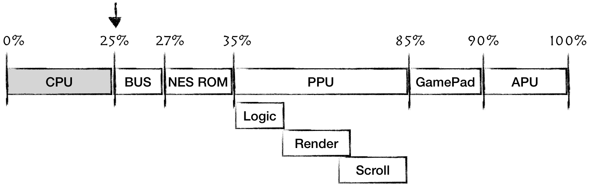
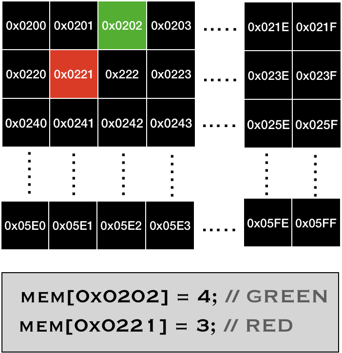

# Running our first game

 <div style="text-align:center"></div>

Great, you've made it this far. What we are going to do next is a bit of a detour. 
The snake game was introduced in this article: [Easy 6502](https://skilldrick.github.io/easy6502/#snake). In fact is not a truly NES game. It is built on top of a 6502 instructions set, but uses quate different memory mappings.

However, it's a fun way to validate that our CPU is truly functional and it's fun to play our first game. 

The majority of logic we are to implement now would be reused some way or another when we will be implementing PPU rendering capabilities. So nothing is a wasted effort. I promise. 

```rust

let game_code = vec![
    0x20, 0x06, 0x06, 0x20, 0x38, 0x06, 0x20, 0x0d, 0x06, 0x20, 0x2a, 0x06, 0x60, 0xa9, 0x02, 0x85,
    0x02, 0xa9, 0x04, 0x85, 0x03, 0xa9, 0x11, 0x85, 0x10, 0xa9, 0x10, 0x85, 0x12, 0xa9, 0x0f, 0x85,
    0x14, 0xa9, 0x04, 0x85, 0x11, 0x85, 0x13, 0x85, 0x15, 0x60, 0xa5, 0xfe, 0x85, 0x00, 0xa5, 0xfe,
    0x29, 0x03, 0x18, 0x69, 0x02, 0x85, 0x01, 0x60, 0x20, 0x4d, 0x06, 0x20, 0x8d, 0x06, 0x20, 0xc3,
    0x06, 0x20, 0x19, 0x07, 0x20, 0x20, 0x07, 0x20, 0x2d, 0x07, 0x4c, 0x38, 0x06, 0xa5, 0xff, 0xc9,
    0x77, 0xf0, 0x0d, 0xc9, 0x64, 0xf0, 0x14, 0xc9, 0x73, 0xf0, 0x1b, 0xc9, 0x61, 0xf0, 0x22, 0x60,
    0xa9, 0x04, 0x24, 0x02, 0xd0, 0x26, 0xa9, 0x01, 0x85, 0x02, 0x60, 0xa9, 0x08, 0x24, 0x02, 0xd0,
    0x1b, 0xa9, 0x02, 0x85, 0x02, 0x60, 0xa9, 0x01, 0x24, 0x02, 0xd0, 0x10, 0xa9, 0x04, 0x85, 0x02,
    0x60, 0xa9, 0x02, 0x24, 0x02, 0xd0, 0x05, 0xa9, 0x08, 0x85, 0x02, 0x60, 0x60, 0x20, 0x94, 0x06,
    0x20, 0xa8, 0x06, 0x60, 0xa5, 0x00, 0xc5, 0x10, 0xd0, 0x0d, 0xa5, 0x01, 0xc5, 0x11, 0xd0, 0x07,
    0xe6, 0x03, 0xe6, 0x03, 0x20, 0x2a, 0x06, 0x60, 0xa2, 0x02, 0xb5, 0x10, 0xc5, 0x10, 0xd0, 0x06,
    0xb5, 0x11, 0xc5, 0x11, 0xf0, 0x09, 0xe8, 0xe8, 0xe4, 0x03, 0xf0, 0x06, 0x4c, 0xaa, 0x06, 0x4c,
    0x35, 0x07, 0x60, 0xa6, 0x03, 0xca, 0x8a, 0xb5, 0x10, 0x95, 0x12, 0xca, 0x10, 0xf9, 0xa5, 0x02,
    0x4a, 0xb0, 0x09, 0x4a, 0xb0, 0x19, 0x4a, 0xb0, 0x1f, 0x4a, 0xb0, 0x2f, 0xa5, 0x10, 0x38, 0xe9,
    0x20, 0x85, 0x10, 0x90, 0x01, 0x60, 0xc6, 0x11, 0xa9, 0x01, 0xc5, 0x11, 0xf0, 0x28, 0x60, 0xe6,
    0x10, 0xa9, 0x1f, 0x24, 0x10, 0xf0, 0x1f, 0x60, 0xa5, 0x10, 0x18, 0x69, 0x20, 0x85, 0x10, 0xb0,
    0x01, 0x60, 0xe6, 0x11, 0xa9, 0x06, 0xc5, 0x11, 0xf0, 0x0c, 0x60, 0xc6, 0x10, 0xa5, 0x10, 0x29,
    0x1f, 0xc9, 0x1f, 0xf0, 0x01, 0x60, 0x4c, 0x35, 0x07, 0xa0, 0x00, 0xa5, 0xfe, 0x91, 0x00, 0x60,
    0xa6, 0x03, 0xa9, 0x00, 0x81, 0x10, 0xa2, 0x00, 0xa9, 0x01, 0x81, 0x10, 0x60, 0xa2, 0x00, 0xea,
    0xea, 0xca, 0xd0, 0xfb, 0x60
];

```

You can find assembly code with comments [here](https://gist.github.com/wkjagt/9043907)

The memory mapping that the game uses:

| Address space | Type  | Description  |
|---|---|---|
| **0xFE** | Input | Random Number Generator |
| **0xFF** | Input | A code of the last pressed Button|
| **[0x0200..0x0600]**  | Output |  Output screen.<br/>Each cell represents the color of a pixel in a 32x32 matrix.<br/><br/> The matrix starts from top left corner, i.e.<br/><br/> **0x0200** - the color of (0,0) pixel <br/> **0x0201** - (1,0) <br/> **0x0220** - (0,1) <br/><br/> <div style="text-align:left"></div> | 

The game executes standart game loop:
* read inputs from user
* compute game state
* render game state to screen
* repeat

We would need to intercept this cycle, in order to provide user input into the input mapping and also to render the state of the screen. Lets modify our CPU run cycle:

```rust
impl CPU {
 // ...   
    pub fn run(&mut self) {
        self.run_with_callback(|_| {});
    }

    pub fn run_with_callback<F>(&mut self, mut callback: F)
    where
        F: FnMut(&mut CPU),
    {
        let ref opcodes: HashMap<u8, &'static opcodes::OpCode> = *opcodes::OPCODES_MAP;

        loop {
            callback(self);
            //....
            match code {
                //...
            }
            // ..
        }
    }
}
```

Now, a client code can provide callback that will be executed on every opcode interpretation cycle.

The sketch of the main method:

```rust
fn main() {
   let game_code = vec![
// ...
   ];
 
   //load the game
   let mut cpu = CPU::new();
   cpu.load(game_code);
   cpu.reset();
 
   // run the game cycle
   cpu.run_with_callback(move |cpu| {
       // TODO:
       // read user input and write it to mem[0xFF]
       // update mem[0xFE] with new Random Number
       // read mem mapped screen state
       // render screen state
   });
}
```

For our input-output we would be using a cross platform library
that's popular in gamedev - [Simple DirectMedia Layer library](https://www.libsdl.org/).

Luckily, there is a convenient crate that provides binding to the lib: [rust-sdl2](https://rust-sdl2.github.io/rust-sdl2/sdl2/)

0) Let's add it to Cargo.toml:

```toml
# ...

[dependencies]
lazy_static = "1.4.0"
bitflags = "1.2.1"

sdl2 = "0.34.0"
rand = "=0.7.3"
```

1) First, we need to initialize sdl:

```rust
use sdl2::event::Event;
use sdl2::EventPump;
use sdl2::keyboard::Keycode;
use sdl2::pixels::Color;
use sdl2::pixels::PixelFormatEnum;
 
fn main() {
   // init sdl2
   let sdl_context = sdl2::init().unwrap();
   let video_subsystem = sdl_context.video().unwrap();
   let window = video_subsystem
       .window("Snake game", (32.0 * 10.0) as u32, (32.0 * 10.0) as u32)
       .position_centered()
       .build().unwrap();
 
   let mut canvas = window.into_canvas().present_vsync().build().unwrap();
   let mut event_pump = sdl_context.event_pump().unwrap();
   canvas.set_scale(10.0, 10.0).unwrap();
 
   //...
}
```

Note: because our game screen is tiny (32x32 pixels), we are setting the scale factor to 10.

> Using `.unwrap()` is justifiable because it's the outer layer of our application. 
> There are no other layers that potentially can handle Err values and do something about it.

Next we will create a texture that would be used for rendering:

```rust
//...
   let creator = canvas.texture_creator();
   let mut texture = creator
       .create_texture_target(PixelFormatEnum::RGB24, 32, 32).unwrap();
//...
```

We are instructing SDL that our texture would have size 32x32 and each pixel would be represented by 3 bytes (for *R*, *G* and *B*)

2) Handling user input is straightforward:

```rust 
fn handle_user_input(cpu: &mut CPU, event_pump: &mut EventPump) {
   for event in event_pump.poll_iter() {
       match event {
           Event::Quit { .. } | Event::KeyDown { keycode: Some(Keycode::Escape), .. } => {
               std::process::exit(0)
           },
           Event::KeyDown { keycode: Some(Keycode::W), .. } => {
               cpu.mem_write(0xff, 0x77);
           },
           Event::KeyDown { keycode: Some(Keycode::S), .. } => {
               cpu.mem_write(0xff, 0x73);
           },
           Event::KeyDown { keycode: Some(Keycode::A), .. } => {
               cpu.mem_write(0xff, 0x61);
           },
           Event::KeyDown { keycode: Some(Keycode::D), .. } => {
               cpu.mem_write(0xff, 0x64);
           }
           _ => {/* do nothing */}
       }
   }
}
```

3) Rendering screen state is a bit trickier. 
Our program assumes 1 byte per pixel, while SDL expects 3 bytes. 
<br/>From the game point of view it doesn't matter much how we map colors, the only 2 maps that are essential are: 
* 0 - Black 
* 1 - White

```rust 
fn color(byte: u8) -> Color {
   match byte {
       0 => sdl2::pixels::Color::BLACK,
       1 => sdl2::pixels::Color::WHITE,
       2 | 9 => sdl2::pixels::Color::GREY,
       3 | 10 => sdl2::pixels::Color::RED,
       4 | 11 => sdl2::pixels::Color::GREEN,
       5 | 12 => sdl2::pixels::Color::BLUE,
       6 | 13 => sdl2::pixels::Color::MAGENTA,
       7 | 14 => sdl2::pixels::Color::YELLOW,
       _ => sdl2::pixels::Color::CYAN,
   }
}
```

Now we can transform CPU screen map into 3 bytes like this:

```rust
    let color_idx = cpu.mem_read(i as u16);
    let (b1, b2, b3) = color(color_idx).rgb();
```

Another caveat is that we don't want to force update SDL canvas, if the screen state hasn't really changed. 
Remember that the CPU would call our callback after each instruction, and most of the time those instructions have nothing to do with the screen. Meantime, updating canvas is a heavy operation.

We can keep track of the screen state by creating a temp buffer, which we will populate from screen state. And only in case of screen changes, we would update SDL canvas

```rust
fn read_screen_state(cpu: &CPU, frame: &mut [u8; 32 * 3 * 32]) -> bool {
   let mut frame_idx = 0;
   let mut update = false;
   for i in 0x0200..0x600 {
       let color_idx = cpu.mem_read(i as u16);
       let (b1, b2, b3) = color(color_idx).rgb();
       if frame[frame_idx] != b1 || frame[frame_idx + 1] != b2 || frame[frame_idx + 2] != b3 {
           frame[frame_idx] = b1;
           frame[frame_idx + 1] = b2;
           frame[frame_idx + 2] = b3;
           update = true;
       }
       frame_idx += 3;
   }
   update
}
```

And the game loop becomes:

```rust
fn main() {
// ...init sdl
// ...load program

   let mut screen_state = [0 as u8; 32 * 3 * 32];
   let mut rng = rand::thread_rng();
 
   cpu.run_with_callback(move |cpu| {
       handle_user_input(cpu, &mut event_pump);
       cpu.mem_write(0xfe, rng.gen_range(1, 16));
 
       if read_screen_state(cpu, &mut screen_state) {
           texture.update(None, &screen_state, 32 * 3).unwrap();
           canvas.copy(&texture, None, None).unwrap();
           canvas.present();
       }
 
       ::std::thread::sleep(std::time::Duration::new(0, 70_000));
   });
}
```

Last sleep statement was added just to slow down things a bit to have a playable pace. 

And there you have it, the first game running on our emulator.

 <div style="text-align:center"></div>
