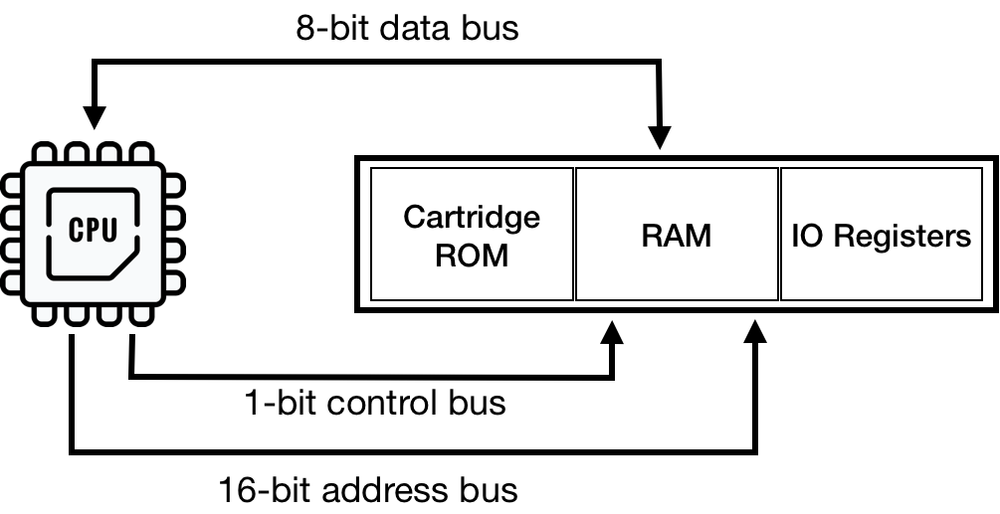
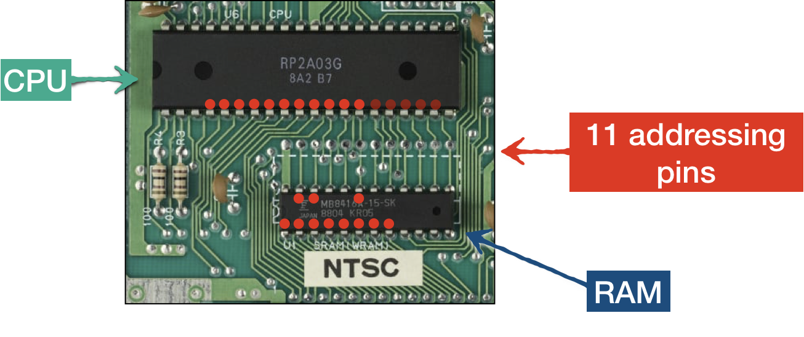

# Emulating BUS

 <div style="text-align:center"></div>

CPU gets access to memory (including memory mapped spaces) using 3 buses:
* address bus carries the address of required location
* control bus notifies if it's a read or write access
* data bus carries the byte of data being read or written

As usual, bus itself is not a device, it's a hardware wiring between platform components. 
And we don't need to implement it as an independent module, rust allows us to wire components directly. 
However, it's a convenient abstraction where we can offload quite a bit of responsibilities to keep CPU code more clean. 

 <div style="text-align:center"></div>

In our current code CPU has direct access to RAM space and it is oblivious to memory mapped regions. 

By introducing Bus module, we would have a single place for:
* Intra device communication:
    * Data reads/writes
    * Routing hardware interrupts to CPU (more on this later)
* Handling memory mappings
* Coordinating PPU and CPU clock cycles (more on this in coming chapters)

Good news is that we don't really need to write full blown emulation of data, control and address buses. Because it's not really a hardware chip, there is no logic that expects any specific behavior from the bus. So we can just codify coordination and signal routing. 

For now, we will implement bare bones of the BUS:
* Access to CPU RAM
* Mirroring 

Mirroring is a side-effect of NES trying to keep things as cheap as possible. It can be seen as an address space being mapped to another address space. 

On a CPU memory map RAM address space **[0x000 .. 0x0800]** (2 KiB) is mirrored three times:
* **[0x800 .. 0x1000]**
* **[0x1000 .. 0x1800]**
* **[0x1800 .. 0x2000]**

This means that there is no difference in accessing memory addresses at 0x0000 or 0x0800 or 0x1000 or 0x1800 for reads or writes. 

The reason for mirroring lies in the fact that CPU RAM has only 2 KiB of ram space and 11 bits are enough for addressing. Naturally NES motherboard had 11 addressing tracks from CPU to RAM


 <div style="text-align:center"></div>

CPU however has **[0x0000 - 0x2000]** addressing space reserved for RAM space - and that's 13 bits. As a result 2 highest bits has no effect when accessing RAM. 
Other way of saying this, when CPU is requesting address at **0b0001_1111_1111_1111** (13 bits) the RAM chip would receive only **0b11_1111_1111** (11 bits) via address bus. 

So despite mirroring looking wasteful, it was a side-effect of the wiring and on a real hardware it cost nothing. Emulators on the other hand have to do extra work to provide the same behaviour. 

Long story short, the BUS needs to make sure to zero out the highest 2 bits if it receives a request in the range of **[0x0000 … 0x2000]**

Similarly address space **[0x2008 .. 0x4000]** mirrors memory mapping for PPU registers **[0x2000 .. 0x2008]**. Those are the only two mirrorings the BUS would be resposible for. Lets codify it right away, eve though we don't have anything for PPU yet.

So let's introduce new module Bus, that will have direct access to RAM

```rust
pub struct Bus {
   cpu_vram: [u8; 2048]
}
 
impl Bus {
   pub fn new() -> Self{
       Bus {
           cpu_vram: [0; 2048]
       }
   }
}
```

Lets codify read/write access:

```rust
const RAM: u16 = 0x0000;
const RAM_MIRRORS_END: u16 = 0x1FFF;
const PPU_REGISTERS: u16 = 0x2000;
const PPU_REGISTERS_MIRRORS_END: u16 = 0x3FFF;
 
impl Mem for Bus {
   fn mem_read(&self, addr: u16) -> u8 {
       match addr {
           RAM ..= RAM_MIRRORS_END => {
               let mirror_down_addr = addr & 0b00000111_11111111;
               self.cpu_vram[mirror_down_addr as usize]
           }
           PPU_REGISTERS ..= PPU_REGISTERS_MIRRORS_END => {
               let _mirror_down_addr = addr & 0b00100000_00000111;
               todo!("PPU is not supported yet")
           }
           _ => {
               println!("Ignoring mem access at {}", addr);
               0
           }
       }
   }
 
   fn mem_write(&mut self, addr: u16, data: u8) {
       match addr {
           RAM ..= RAM_MIRRORS_END => {
               let mirror_down_addr = addr & 0b11111111111;
               self.cpu_vram[mirror_down_addr as usize] = data;
           }
           PPU_REGISTERS ..= PPU_REGISTERS_MIRRORS_END => {
               let _mirror_down_addr = addr & 0b00100000_00000111;
               todo!("PPU is not supported yet");
           }
           _ => {
               println!("Ignoring mem write-access at {}", addr);
           }
       }
   }
}
```

Last step: replace direct access to RAM in CPU with access via BUS

```rust
pub struct CPU {
   pub register_a: u8,
   pub register_x: u8,
   pub register_y: u8,
   pub status: CpuFlags,
   pub program_counter: u16,
   pub stack_pointer: u8,
   pub bus: Bus,
}
 
 
impl Mem for CPU {
   fn mem_read(&self, addr: u16) -> u8 {
       self.bus.mem_read(addr)
   }
 
   fn mem_write(&mut self, addr: u16, data: u8) {
       self.bus.mem_write(addr, data)
   }
   fn mem_read_u16(&self, pos: u16) -> u16 {
       self.bus.mem_read_u16(pos)
   }
 
   fn mem_write_u16(&mut self, pos: u16, data: u16) {
       self.bus.mem_write_u16(pos, data)
   }
}

impl CPU {
   pub fn new() -> Self {
       CPU {
           register_a: 0,
           register_x: 0,
           register_y: 0,
           stack_pointer: STACK_RESET,
           program_counter: 0,
           status: CpuFlags::from_bits_truncate(0b100100),
           bus: Bus::new(),
       }
   }
   // ...
}
```

And that's pretty much it for now. Wasn't hard, right?
