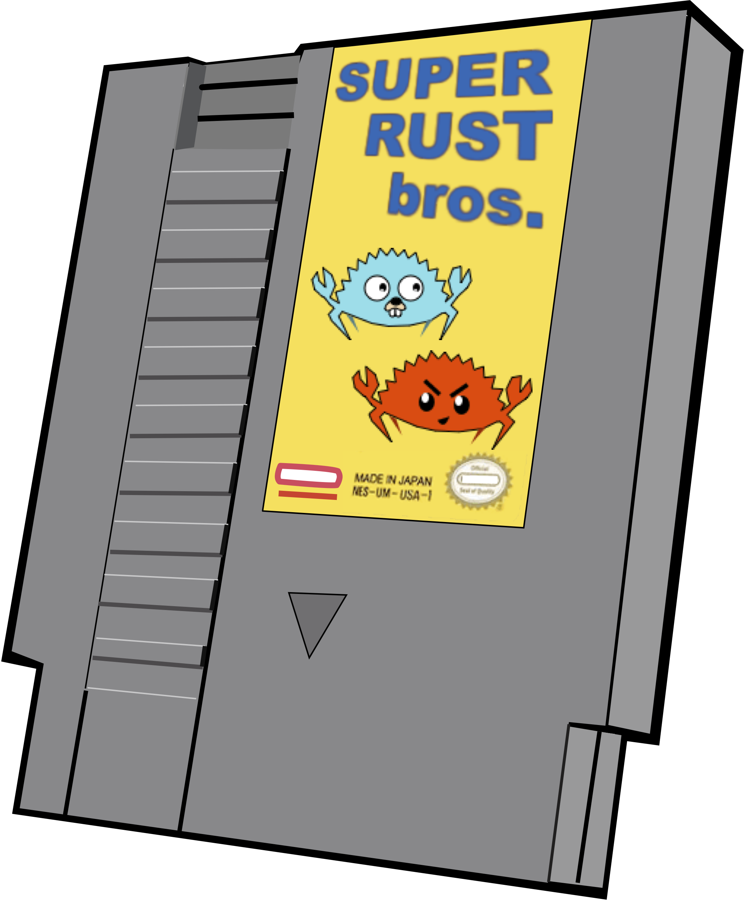
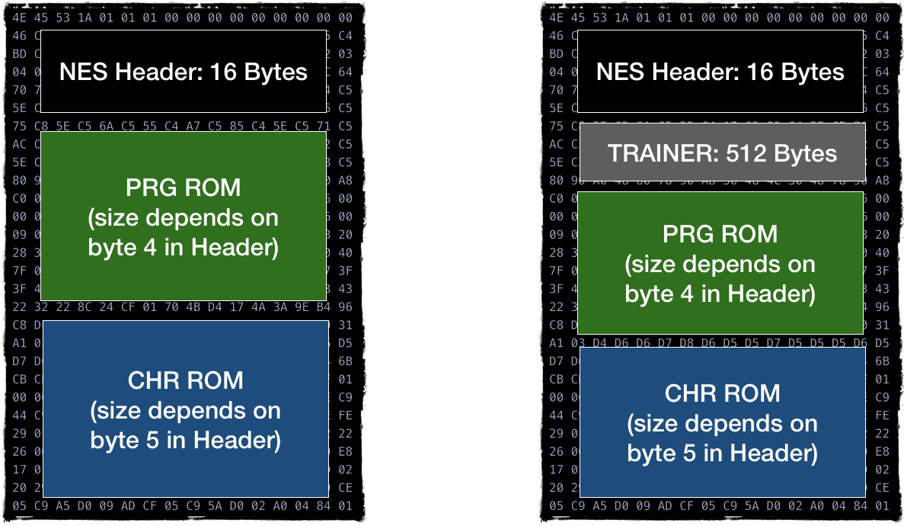
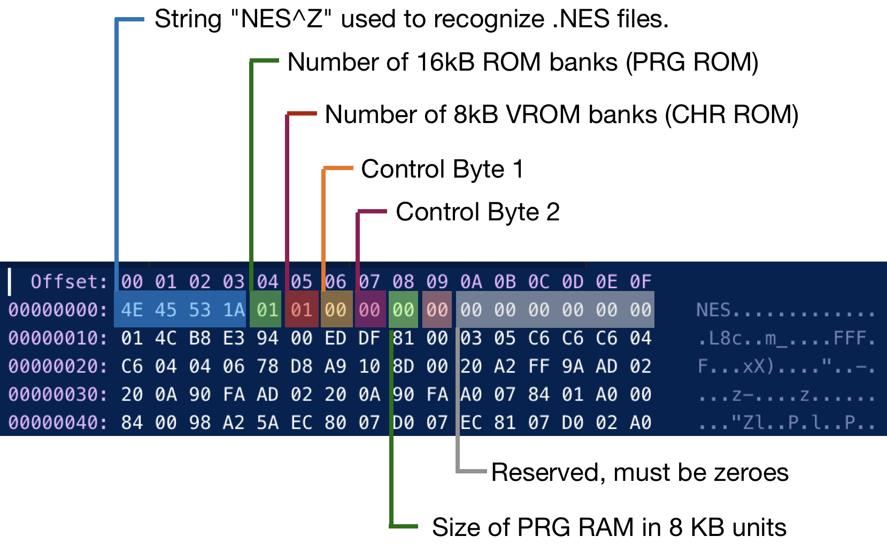

# Cartridges

 <div style="text-align:center"></div>

The first version of cartridges were relatively straightforward. They carried 2 banks of ROM memory: PRG ROM for code and CHR ROM for visual graphics. 

Upon insertion into the console, PRG ROM got connected to CPU and CHR ROM got connected to PPU. So on a hardware level, CPU wasn't able to access CHR ROM and PPU wasn't able to access PRG ROM. 

> Later versions of cartridges were supplied with additional hardware: 
> * mappers to provide access to extended ROM memory: both CHR ROM and PRG ROM (beyond addressible 64 KiB)
> * additional RAM with a battery to save and restore game state

However, we won't be working with cartridges, we will be working with files containing ROM images.

There are several file formats for ROM dumps, the most popular one is iNES designed by [Marat Fayzullin](http://fms.komkon.org)

 <div style="text-align:center"></div>

The file consists of 3-4 sections:
* 16 byte header
* optional 512 of so-called Trainer, a data that was created by famicom copiers to keep their own mapping. This section can be skipped
* Section containing PRG ROM code
* Section containing CHR ROM data

The header is the most interesting part.

 <div style="text-align:center"></div>

Control Byte 1 and Control Byte 2 (Byte 06 and 07 in header) contain some additional info about the file data, but it's packed in bits.

|   |   |
|---|---|
| <div style="text-align:center"></div> | <div style="text-align:center"></div>       | 
 

<br/>
We won't cover and support iNES 2.0 format as it's not very popular. But you can find the formal format specification of both iNES version [here](https://formats.kaitai.io/ines/index.html)

The bare minimum information we care about at this point:
* PRG ROM
* CHR ROM
* Mapper type
* Mirroring type: Horizontal, Vertical, 4 Screen

We would discuss mirroring extensively in the coming PPU chapters. 
For now, we just need to figure out which mirroring type the game is using. 

For now, we would be aiming only to support iNES 1.0 format and mapper 0. 

Mapper 0 essentially means "no mapper", that both CHR and PRG ROM being read by the CPU as is. 

Let's start by defining Rom data structure:

```rust
#[derive(Debug, PartialEq)]
pub enum Mirroring {
   VERTICAL,
   HORIZONTAL,
   FOUR_SCREEN,
}
 
pub struct Rom {
   pub prg_rom: Vec<u8>,
   pub chr_rom: Vec<u8>,
   pub mapper: u8,
   pub screen_mirroring: Mirroring,
}

```

Then we need to write parsing code:

```rust
impl Rom {
   pub fn new(raw: &Vec<u8>) -> Result<Rom, String> {
       if &raw[0..4] != NES_TAG {
           return Err("File is not in iNES file format".to_string());
       }
 
       let mapper = (raw[7] & 0b1111_0000) | (raw[6] >> 4);
 
       let ines_ver = (raw[7] >> 2) & 0b11;
       if ines_ver != 0 {
           return Err("NES2.0 format is not supported".to_string());
       }
 
       let four_screen = raw[6] & 0b1000 != 0;
       let vertical_mirroring = raw[6] & 0b1 != 0;
       let screen_mirroring = match (four_screen, vertical_mirroring) {
           (true, _) => Mirroring::FOUR_SCREEN,
           (false, true) => Mirroring::VERTICAL,
           (false, false) => Mirroring::HORIZONTAL,
       };
 
       let prg_rom_size = raw[4] as usize * PRG_ROM_PAGE_SIZE;
       let chr_rom_size = raw[5] as usize * CHR_ROM_PAGE_SIZE;
 
       let skip_trainer = raw[6] & 0b100 != 0;
 
       let prg_rom_start = 16 + if skip_trainer { 512 } else { 0 };
       let chr_rom_start = prg_rom_start + prg_rom_size;
 
       Ok(Rom {
           prg_rom: raw[prg_rom_start..(prg_rom_start + prg_rom_size)].to_vec(),
           chr_rom: raw[chr_rom_start..(chr_rom_start + chr_rom_size)].to_vec(),
           mapper: mapper,
           screen_mirroring: screen_mirroring,
       })
   }
}

```

As always, don't forget tests!


Next we need to connect our bus to the ROM:

```rust 
pub struct Bus {
   cpu_vram: [u8; 2048],
   rom: Rom,
}
 
impl Bus {
   pub fn new(rom: Rom) -> Self {
       Bus {
           cpu_vram: [0; 2048],
           rom: rom,
       }
   }
   //....
}
```


And finally we need to map address space **[0x8000 … 0x10000]** to cartridge PRG Rom space. 

One caveat: for the mapper 0, PRG Rom Size might be 16 KiB or 32 KiB.
Because **[0x8000 … 0x10000]** range gives us 32 KiB of addresible space, we need to map upper 16 KiB to lower 16 KiB if the game has only 16 KiB worth of PRG ROM. 

```rust 
impl Mem for Bus {
   fn mem_read(&self, addr: u16) -> u8 {
       match addr {
           //….
           0x8000..=0xFFFF => self.read_prg_rom(addr),
       }
   }
 
   fn mem_write(&mut self, addr: u16, data: u8) {
       match addr {
           //...
           0x8000..=0xFFFF => {
               panic!("Attempt to write to Cartridge ROM space")
           }
       }
   }
}

impl Bus {
  // ...
 
   fn read_prg_rom(&self, mut addr: u16) -> u8 {
       addr -= 0x8000;
       if self.rom.prg_rom.len() == 0x4000 && addr >= 0x4000 {
           //mirror if needed
           addr = addr % 0x4000;
       }
       self.rom.prg_rom[addr as usize]
   }
}
```

You can download your first NES ROM dump file here: <TODO>
You need to change main method to load and run it.


Spoiler alert: it's a slight modification of a snake game. The game expects pretty much the same memory map for input device, screen output and random number generator. 

