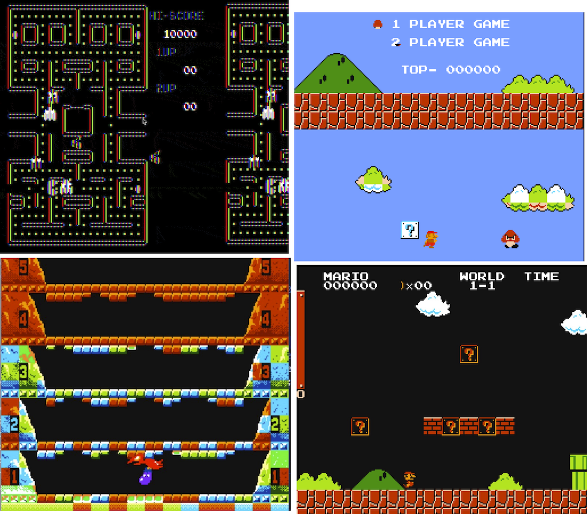

# Emulating Picture Processing Unit

Picture Processing Unit is the hardest one to emulate. Because it deals with the most complicated aspect of gaming - rendering the state of the screen, but also NES PPU has quite a bit of quirks. While emulating some of them is not necessarily required, others are crucially important to have a playable environment. 
64KiB is not a hell lot of space, and NES platform designers tried to squeeze out of it as much as possible. Working with CHR ROM data means pretty much working with compressed data format; it requires a lot of bit arithmetic, uncompressing, and parsing.

 

We would create the PPU emulator using four main steps:
* Emulating Registers and NMI Interruption
* Parsing and drawing tiles from CHR ROM
* Rendering PPU state: 
    * Rendering background tiles 
    * Rendering sprites
* Implementing the scroll

The first step is very similar to emulating the CPU. 
After the third one it will be possible to play games with static screens:
- [PacMan](https://en.wikipedia.org/wiki/Pac-Man)
- [Donkey Kong](https://en.wikipedia.org/wiki/Donkey_Kong)
- [Baloon Fight](https://en.wikipedia.org/wiki/Balloon_Fight)

When we are done with the scroll, we could play platformers like [Super Mario Bros](https://en.wikipedia.org/wiki/Super_Mario_Bros). 

So let's start.