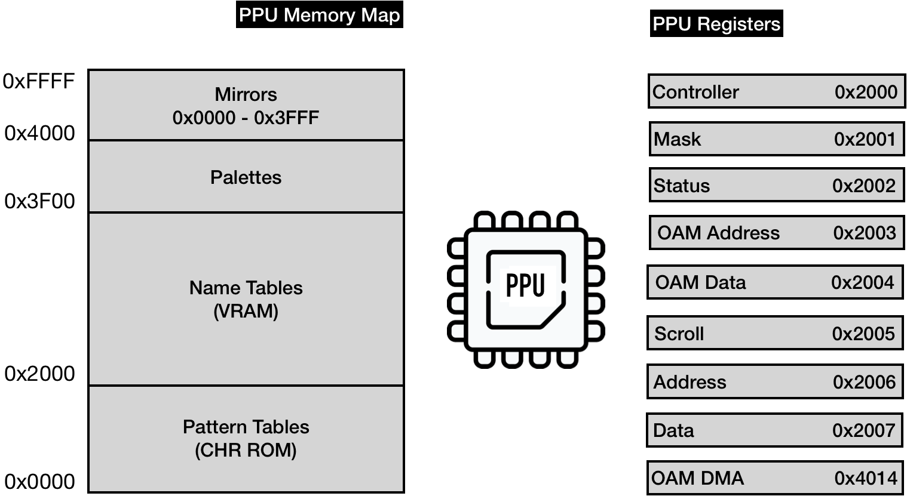
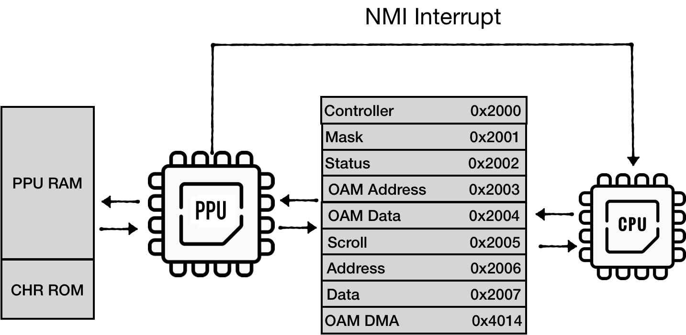
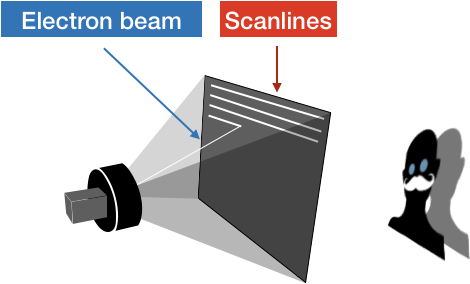
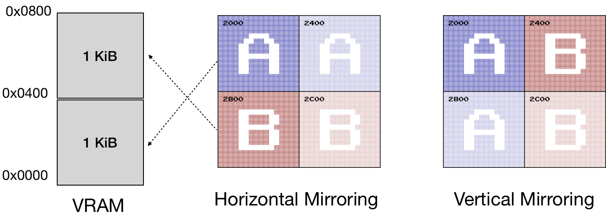

# Emulating PPU Registers
PPU has its own memory map, composed of PPU RAM, CHR ROM, and address space mirrors.
PPU exposes 8 I/O Registers that are used by the CPU for communication. Those registers are mapped to **[0x2000 - 0x2007]** in the CPU memory map (and mirrored every 8 bytes through the region of **[0x2008 .. 0x3FFF]**)

 <div style="text-align:center"></div>

To be precise, PPU has its own bus used to communicate with RAM and cartridge CHR ROM. But we don't necessarily need to emulate the bus.

2 registers are responsible for accessing PPU memory map:
* Address (0x2006) & Data (0x2007) - provide access to the memory map available for PPU

3 registers control internal memory(OAM) that keeps the state of sprites
* OAM Address (0x2003) & OAM Data (0x2004) - Object Attribute Memory - the space responsible for sprites
* Direct Memory Access (0x4014) - for fast copying of 256 bytes from CPU RAM to OAM

3 Write-only registers are controlling PPU actions:
* Controller (0x2000) - instructs PPU on general logic flow (which memory table to use, if PPU should interrupt CPU, etc.)
* Mask (0x2001) - instructs PPU how to render sprites and background
* Scroll (0x2005) - instructs PPU how to set a viewport

One read-only register is used for reporting PPU status:
* Status 0x2002

The full spec of the registers can be found on [NES Dev wiki](http://wiki.nesdev.com/w/index.php/PPU_registers).

 <div style="text-align:center"></div>

Two communication channels exist between CPU and PPU:
* CPU is driving communication through IO registers
* PPU sends an interrupt signal to CPU upon entering V-BLANK period

> PPU execution life cycle was tightly coupled with the electron beam of the TV screen.
>
> The PPU renders 262 scanlines per frame. (0 - 240 are visible scanlines, the rest are so-called vertical overscan)<br/>
> Each scanline lasts for 341 PPU clock cycles, with each clock cycle producing one pixel. (the first 256 pixels are visible, the rest is horizontal overscan)<br/>
> The NES screen resolution is 320x240, thus scanlines 241 - 262 are not visible.
>
> <div style="text-align:center"></div>
> Upon entering the 241st scanline, PPU triggers VBlank NMI on the CPU. PPU makes no memory accesses during 241-262 scanlines, so PPU memory can be freely accessed by the program. The majority of games play it safe and update the screen state only during this period, essentially preparing the view state for the next frame.

## PPU sketch

Initial sketch of out PPU would look like this:

```rust
pub struct NesPPU {
   pub chr_rom: Vec<u8>,
   pub palette_table: [u8; 32],
   pub vram: [u8; 2048],
   pub oam_data: [u8; 256],

   pub mirroring: Mirroring,
}
```

Where:
* **chr_rom** - visuals of a game stored on a cartridge
* **palette_table** - internal memory to keep palette tables used by a screen
* **vram** - 2 KiB banks of space to hold background information
* and **oam_data** - internal memory to keep state of sprites


Mirroring and chr_rom are specific to each game and provided by a cartridge

```rust
impl NesPPU {
   pub fn new(chr_rom: Vec<u8>, mirroring: Mirroring) -> Self {
       NesPPU {
           chr_rom: chr_rom,
           mirroring: mirroring,
           vram: [0; 2048],
           oam_data: [0; 64 * 4],
           palette_table: [0; 32],
       }
   }
}
```

## Emulating PPU memory access: Address and Data registers

Let's try to emulate two of the most complex registers: Address (**0x2006**) and Data(**0x2007**)

There are multiple caveats in the way the CPU can access PPU RAM. Say the CPU wants to access memory cell at 0x0600 PPU memory space:

1) It has to load the requesting address into the Addr register. It has to write to the register twice - to load 2 bytes into 1-byte register:<br/><br/>

```bash
 LDA #$06
 STA $2006
 LDA #$00
 STA $2006
```

Note: it **doesn't** follow *little-endian* notation.

2) Then, the CPU can request data load from PPU Data register (0x2007)
```bash 
LDA $2007
```

> Because CHR ROM and RAM are considered external devices to PPU, PPU can't return the value immediately. PPU has to fetch the data and keep it in internal buffer.<br/>
> The first read from 0x2007 would return the content of this internal buffer filled during the previous load operation. From the CPU perspective, this is a dummy read.

3) CPU has to read from 0x2007 one more time to finally get the value from the PPUs internal buffer.

```bash 
LDA $2007
```

> Also note that read or write access to 0x2007 increments the PPU Address (0x2006). The increment size is determined by the state of the Control register (0x2000):
>  <div style="text-align:left"></div>

The sequence of requests can be illustrated in this diagram:

<div style="text-align:center"></div>

>**IMPORTANT:** This buffered reading behavior is specific only to ROM and RAM. <br/>
> Reading palette data from $3F00-$3FFF works differently. The palette data is placed immediately on the data bus, and hence no dummy read is required.

Lets model Address register first:

```rust
pub struct AddrRegister {
   value: (u8, u8),
   hi_ptr: bool,
}

impl AddrRegister {
   pub fn new() -> Self {
       AddrRegister {
           value: (0, 0), // high byte first, lo byte second
           hi_ptr: true,
       }
   }
   fn set(&mut self, data: u16) {
       self.value.0 = (data >> 8) as u8;
       self.value.1 = (data & 0xff) as u8;
   }

   pub fn update(&mut self, data: u8) {
       if self.hi_ptr {
           self.value.0 = data;
       } else {
           self.value.1 = data;
       }

       if self.get() > 0x3fff { //mirror down addr above 0x3fff
           self.set(self.get() & 0b11111111111111);
       }
       self.hi_ptr = !self.hi_ptr;
   }

   pub fn increment(&mut self, inc: u8) {
       let lo = self.value.1;
       self.value.1 = self.value.1.wrapping_add(inc);
       if lo > self.value.1 {
           self.value.0 = self.value.0.wrapping_add(1);
       }
       if self.get() > 0x3fff {
           self.set(self.get() & 0b11111111111111); //mirror down addr above 0x3fff
       }
   }

   pub fn reset_latch(&mut self) {
       self.hi_ptr = true;
   }

   pub fn get(&self) -> u16 {
       ((self.value.0 as u16) << 8) | (self.value.1 as u16)
   }
}
```

Next, we need to expose this register as being writable:

```rust
pub struct NesPPU {
   //...
   addr: AddrRegister,
}

impl NesPPU {
// ...
   fn write_to_ppu_addr(&mut self, value: u8) {
       self.addr.update(value);
   }
}
```

Next, we can sketch out Controller Register:

```rust
bitflags! {

   // 7  bit  0
   // ---- ----
   // VPHB SINN
   // |||| ||||
   // |||| ||++- Base nametable address
   // |||| ||    (0 = $2000; 1 = $2400; 2 = $2800; 3 = $2C00)
   // |||| |+--- VRAM address increment per CPU read/write of PPUDATA
   // |||| |     (0: add 1, going across; 1: add 32, going down)
   // |||| +---- Sprite pattern table address for 8x8 sprites
   // ||||       (0: $0000; 1: $1000; ignored in 8x16 mode)
   // |||+------ Background pattern table address (0: $0000; 1: $1000)
   // ||+------- Sprite size (0: 8x8 pixels; 1: 8x16 pixels)
   // |+-------- PPU master/slave select
   // |          (0: read backdrop from EXT pins; 1: output color on EXT pins)
   // +--------- Generate an NMI at the start of the
   //            vertical blanking interval (0: off; 1: on)
   pub struct ControlRegister: u8 {
       const NAMETABLE1              = 0b00000001;
       const NAMETABLE2              = 0b00000010;
       const VRAM_ADD_INCREMENT      = 0b00000100;
       const SPRITE_PATTERN_ADDR     = 0b00001000;
       const BACKROUND_PATTERN_ADDR  = 0b00010000;
       const SPRITE_SIZE             = 0b00100000;
       const MASTER_SLAVE_SELECT     = 0b01000000;
       const GENERATE_NMI            = 0b10000000;
   }
}

impl ControlRegister {
   pub fn new() -> Self {
       ControlRegister::from_bits_truncate(0b00000000)
   }

   pub fn vram_addr_increment(&self) -> u8 {
       if !self.contains(ControlRegister::VRAM_ADD_INCREMENT) {
           1
       } else {
           32
       }
   }

   pub fn update(&mut self, data: u8) {
       self.bits = data;
   }
}
```

And also expose it as being writable:

```rust
pub struct NesPPU {
   pub ctrl: ControlRegister,
   //...
}

impl NesPPU {
   //...
   fn write_to_ctrl(&mut self, value: u8) {
       self.ctrl.update(value);
   }
}
```


Now we can try to implement reading PPU memory:

```rust
impl NesPPU {
   //...
   fn increment_vram_addr(&mut self) {
       self.addr.increment(self.ctrl.vram_addr_increment());
   }


   fn read_data(&mut self) -> u8 {
       let addr = self.addr.get();
       self.increment_vram_addr();


       match addr {
           0..=0x1fff => todo!("read from chr_rom"),
           0x2000..=0x2fff => todo!("read from RAM"),
           0x3000..=0x3eff => panic!("addr space 0x3000..0x3eff is not expected to be used, requested = {} ", addr),
           0x3f00..=0x3fff =>
           {
               self.palette_table[(addr - 0x3f00) as usize]
           }
           _ => panic!("unexpected access to mirrored space {}", addr),
       }
   }
}
```


We can emulate this internal buffer behavior for RAM and ROM by using a temporary field to hold a value from a previous read request:

```rust

pub struct NesPPU {
    //..
    internal_data_buf: u8,
}

impl NesPPU {
 // ...

    fn read_data(&mut self) -> u8 {
        let addr = self.addr.get();
        self.increment_vram_addr();

        match addr {
            0..=0x1fff => {
                let result = self.internal_data_buf;
                self.internal_data_buf = self.chr_rom[addr as usize];
                result
            }
            0x2000..=0x2fff => {
                let result = self.internal_data_buf;
                self.internal_data_buf = self.vram[self.mirror_vram_addr(addr) as usize];
                result
            }
            // ..
        }
    }
}
```

Writing to PPU memory can be implemented in a similar way, just don't forget that writes to 0x2007 also increments Address Register.

## Mirroring

One thing that isn't covered is how ```mirror_vram_addr``` is implemented.

Again the NESDEV wiki provides excellent coverage of this topic: [Mirroring](http://wiki.nesdev.com/w/index.php/Mirroring).

VRAM mirroring is tightly coupled with the way NES implements scrolling of the viewport.
We would spend enough time discussing this in the chapter about Scroll.
For now, we can just code the mirroring behavior.

NES uses 1 KiB of VRAM to represent a single screen state. Having 2 KiB of VRAM onboard means that NES can keep a state of 2 screens.


On the PPU memory map, the range ***[0x2000...0x3000]*** is reserved for Nametables (screens states)- 4 KiB of addressable space. Two "additional" screens have to be mapped to existing ones.
The way they are mapped depends on the mirroring type, specified by a game (iNES files have this info in the header)

<div style="text-align:center"></div>

For example, for *Horizontal Mirroring*:
* Address spaces **[0x2000 .. 0x2400]** and **[0x2400 .. 0x2800]** should be mapped to the first 1 KiB of VRAM.
* Address spaces **[0x2800 .. 0x2C00]** and **[0x2C00 .. 0x3000]** should be mapped to the second 1 KiB of VRAM.

The region **[0x3000 .. 0x3EFF]** is a mirror from **[0x2000 .. 0x2EFF]**. 

One way to codify that:

```rust
impl NesPPU {
   //...  
 
   // Horizontal:
   //   [ A ] [ a ]
   //   [ B ] [ b ]
 
   // Vertical:
   //   [ A ] [ B ]
   //   [ a ] [ b ]
   pub fn mirror_vram_addr(&self, addr: u16) -> u16 {
       let mirrored_vram = addr & 0b10111111111111; // mirror down 0x3000-0x3eff to 0x2000 - 0x2eff
       let vram_index = mirrored_vram - 0x2000; // to vram vector
       let name_table = vram_index / 0x400; // to the name table index
       match (&self.mirroring, name_table) {
           (Mirroring::Vertical, 2) | (Mirroring::Vertical, 3) => vram_index - 0x800,
           (Mirroring::Horizontal, 2) => vram_index - 0x400,
           (Mirroring::Horizontal, 1) => vram_index - 0x400,
           (Mirroring::Horizontal, 3) => vram_index - 0x800,
           _ => vram_index,
       }
   }
}

```

## Connecting PPU to the BUS 

One last step is to connect PPU to the BUS:

```rust
pub struct Bus {
    cpu_vram: [u8; 2048],
    prg_rom: Vec<u8>,
    ppu: NesPPU
}

impl Bus {
    pub fn new(rom: Rom) -> Self {
        let ppu = NesPPU::new(rom.chr_rom, rom.screen_mirroring);

        Bus {
            cpu_vram: [0; 2048],
            prg_rom: rom.prg_rom,
            ppu: ppu,
        }
    }
//..

}
```

And provide memory mapping for the registers we've implemented so far:


```rust

impl Bus {
    //...
    fn mem_read(&mut self, addr: u16) -> u8 {
        match addr {
            RAM..=RAM_MIRRORS_END => {
                let mirror_down_addr = addr & 0b00000111_11111111;
                self.cpu_vram[mirror_down_addr as usize]
            }
            0x2000 | 0x2001 | 0x2003 | 0x2005 | 0x2006 | 0x4014 => {
                panic!("Attempt to read from write-only PPU address {:x}", addr);
            }
            0x2007 => self.ppu.read_data(),

            0x2008..=PPU_REGISTERS_MIRRORS_END => {
                let mirror_down_addr = addr & 0b00100000_00000111;
                self.mem_read(mirror_down_addr)
            }
            0x8000..=0xFFFF => self.read_prg_rom(addr),

            _ => {
                println!("Ignoring mem access at {}", addr);
                0
            }
        }
    }

    fn mem_write(&mut self, addr: u16, data: u8) {
        match addr {
            RAM..=RAM_MIRRORS_END => {
                let mirror_down_addr = addr & 0b11111111111;
                self.cpu_vram[mirror_down_addr as usize] = data;
            }
            0x2000 => {
                self.ppu.write_to_ctrl(data);
            }

            0x2006 => {
                self.ppu.write_to_ppu_addr(data);
            }
            0x2007 => {
                self.ppu.write_to_data(data);
            }

            0x2008..=PPU_REGISTERS_MIRRORS_END => {
                let mirror_down_addr = addr & 0b00100000_00000111;
                self.mem_write(mirror_down_addr, data);
            }
            0x8000..=0xFFFF => panic!("Attempt to write to Cartridge ROM space: {:x}", addr),

            _ => {
                println!("Ignoring mem write-access at {}", addr);
            }
        }
    }
}
```

The communication with the rest of the registers is similar. I leave this exercise to the reader.

<br/>

------

> The full source code for this chapter: <a href="https://github.com/bugzmanov/nes_ebook/tree/master/code/ch6.1" target="_blank">GitHub</a>
