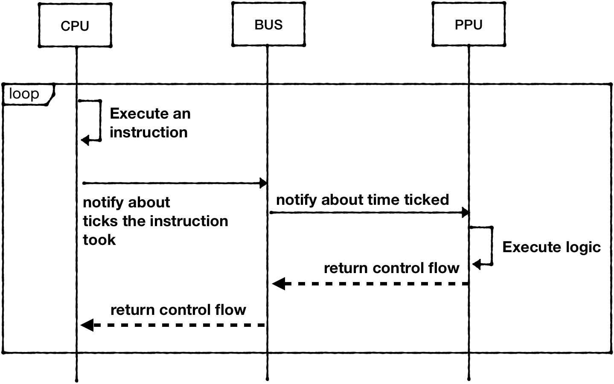
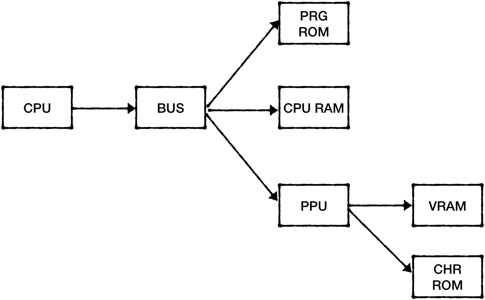
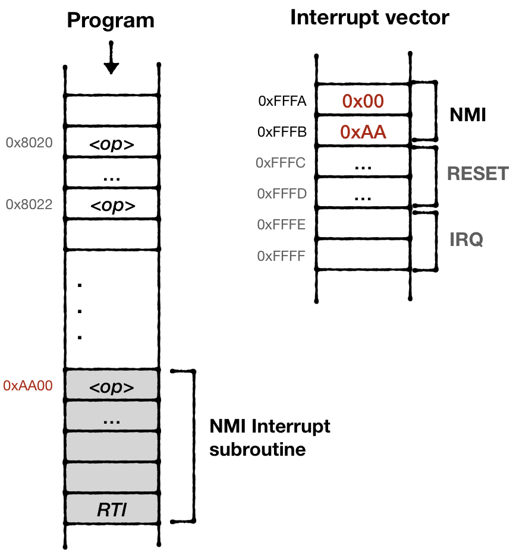

# Emulating Interrupts

Interrupts are the mechanism for the CPU to break the sequential execution flow and react to events that require immediate attention ("attend to an interrupt").

We've already implemented one of the supported interrupts - RESET signal. This interrupt notifies the CPU that a new cartridge was inserted and the CPU needs to execute the reset subroutine.

 <div style="text-align:center"></div>


PPU communicates that it's entering the VBLANK phase for the frame via another interrupt signal - NMI (Non-Maskable Interrupt). 
From a high-level perspective, this means two things:
- PPU is done rendering the current frame
- CPU can safely access PPU memory to update the state for the next frame.

> The reason why VBLANK phase is unique is that while PPU is rendering visible scan lines, it's constantly using internal buffers and memory. External access to IO registers can corrupt data in those buffers and cause noticeable graphic glitches. 

Unlike other interrupts, CPU can't ignore the NMI. And the **Disable Interrupt** flag in the **Status register P** has no effect on how the CPU attends to it.
The CPU however, might instruct PPU to not trigger NMI by resetting the 7th bit in the PPU Control register. 

## Clock cycles

The NMI interrupt is tightly connected to PPU clock cycles:
* the PPU renders 262 scan lines per frame. 
* each scanline lasts for 341 PPU clock cycles 
* upon entering scanline 241, PPU triggers NMI interrupt
* PPU clock cycles are 3 times faster than CPU clock cycles

Nothing beats NESDev wiki in providing [details on line-by-line timing](http://wiki.nesdev.com/w/index.php/PPU_rendering#Line-by-line_timing)

But to simplify, 
 * each PPU frame takes ```341*262=89342 PPU clocks cycles```
 * CPU is guaranteed to receive NMI every interrupt ```~29780 CPU cycles```

> **NOTE:** PPU Cycles and CPU Cycles are not the same things

On the NES Platform, all components were running independently in parallel. This makes NES a distributed system. The coordination hast to be carefully designed by game developers based on timing specs of the instructions. I can only imagine how tedious this manual process is. 

The emulator can take multiple approaches to simulate this behavior:
1) Allocate a thread per component and simulate proper timing for each instruction. I don't know any emulator that does that. Simulating proper timing is a hell of a task. Second, this approach requires allocating more hardware resources than needed for the job (PPU, CPU, and APU would require 3 threads, and potentially would occupy 3 cores on the host machine)

2) Execute all components sequentially in one thread, by advancing one clock cycle at a time in each component. This is similar to creating a green-thread runtime and using one dedicated OS thread to run this runtime. It would require substantial investment in creating green-threads runtime. 

3) Execute all components sequentially in one thread, but by letting CPU to execute one full instruction, compute the clock cycles budget for other components and let them run within the budget. This technique is called ["catch-up"](http://wiki.nesdev.com/w/index.php/Catch-up) <br/> <br/>For example, CPU takes 2 cycles to execute "LDA #$01" (opcode 0xA9), which means that PPU can run for 6 PPU cycles now (PPU clock is ticking three times faster than CPU clock) and APU can run for 1 cycle (APU clock is two times slower)

Because we already have CPU loop mostly spec'd out, the third approach would be the easiest to implement. Granted, it would be the least accurate one. But it's good enough to have something playable as soon as possible.
 
So the flow would look like this: 

 <div style="text-align:center"></div>

Starting from the CPU:

```rust
impl CPU {
   pub fn run_with_callback<F>(&mut self, mut callback: F)
   where
       F: FnMut(&mut CPU),
   {
      //...
       loop {
        // …
           self.bus.tick(opcode.cycles);
 
           if program_counter_state == self.program_counter {
               self.program_counter += (opcode.len - 1) as u16;
           }
   }
 
   }
}

```

The Bus should keep track of executed cycles and propagate tick call to PPU, but because PPU clock is 3 times faster than CPU clock, it would multiply the value:


```rust
pub struct Bus {
   cpu_vram: [u8; 2048],
   prg_rom: Vec<u8>,
   ppu: NesPPU,
 
   cycles: usize,
}
 
impl Bus {
   pub fn new(rom: Rom) -> Self {
       let ppu = NesPPU::new(rom.chr_rom, rom.screen_mirroring);
 
       Bus {
           cpu_vram: [0; 2048],
           prg_rom: rom.prg_rom,
           ppu: ppu,
           cycles: 0,
       }
   }
   pub fn tick(&mut self, cycles: u8) {
       self.cycles += cycles as usize;
       self.ppu.tick(cycles * 3);
   }
}
```

The PPU would track cycles and calculate which scanline is should be drawing:

```rust
pub struct NesPPU {
   // ...
   scanline: u16,
   cycles: usize,
}
 
 
 
impl NesPPU {
// …
   pub fn tick(&mut self, cycles: u8) -> bool {
       self.cycles += cycles as usize;
       if self.cycles >= 341 {
           self.cycles = self.cycles - 341;
           self.scanline += 1;
 
           if self.scanline == 241 {
               if self.ctrl.generate_vblank_nmi() {
                   self.status.set_vblank_status(true);
                   todo!("Should trigger NMI interrupt")
               }
           }
 
           if self.scanline >= 262 {
               self.scanline = 0;
               self.status.reset_vblank_status();
               return true;
           }
       }
       return false;
   }
}

```

Some crucial details are still missing: some of the CPU operations take variable clock time depending on the execution flow. 
For example, conditional branch operations (like BNE) take an additional CPU cycle if the comparison is successful. And yet another CPU cycle if the JUMP would result in program counter to be on another memory page

> Memory page size is 256 bytes. For example, the range [0x0000 .. 0x00FF]- belongs to page 0, [0x0100 .. 0x01FF] belongs to page 1, etc.
> It's enough to compare the upper byte of the addresses to see if they are on the same page. 

I leave it up to the reader to figure out how to codify those additional ticks that may or may not happen. 

# Interrupts

So far our dependency graph looks one-directional:

 <div style="text-align:center"></div>

The problem is that we want to deliver signals from PPU to CPU and Rust doesn't really allow to have dependency cycles easily. 

One way to overcome this is to replace the push model with pull. The CPU can ask if there are interrupts ready at the beginning of the interpret cycle. 

```rust
impl CPU {
//...
   pub fn run_with_callback<F>(&mut self, mut callback: F)
   where
       F: FnMut(&mut CPU),
   {
       // ...
       loop {
           if let Some(_nmi) = self.bus.poll_nmi_status() {
               self.interrupt_nmi();
           } 
           // …
       }
    }
}
```

The final piece is to implement interrupt behavior.
Upon receiving an interrupt signal the CPU:
1) finishes execution of current instruction
2) Stores Program Counter and Status flag to the stack
3) Disables Interrupts by setting **Disable Interrupt** flag in the status register P
4) Loads the Address of Interrupt handler routine from 0xFFFA (for NMI)
5) Sets **Program Counter** register pointing to that address

 <div style="text-align:center"></div>


Interrupt handler would have to call RTI operation at the end to finish interrupt attendance. That would restore Status Flag and Program Counter position from the stack. Effectively going back to the execution flow where it was left off. 


```rust
   fn interrupt_nmi(&mut self) {
       self.stack_push_u16(self.program_counter);
       let mut flag = self.status.clone();
       flag.set(CpuFlags::BREAK, 0);
       flag.set(CpuFlags::BREAK2, 1);
 
       self.stack_push(flag.bits);
       self.status.insert(CpuFlags::INTERRUPT_DISABLE);
 
       self.bus.tick(2);
       self.program_counter = self.mem_read_u16(0xfffA);
   }
```

In addition to scanline position, PPU would immidiately trigger NMI if both of these conditions are met: 
* PPU is VBLANK state
* "Generate NMI" bit in the controll Register is updated from 0 to 1.

```rust
impl PPU for NesPPU {
// ...    
    fn write_to_ctrl(&mut self, value: u8) {
        let before_nmi_status = self.ctrl.generate_vblank_nmi();
        self.ctrl.update(value);
        if !before_nmi_status && self.ctrl.generate_vblank_nmi() && self.status.is_in_vblank() {
            self.nmi_interrupt = Some(1);
        }
    }
//..
}
```

# Other CPU interrupts

In our CPU implementation, we've implemented opcode **0x00** just as a return from CPU fetch-decode-execute cycle, but in reallity it should trigger BRK interrupt. This is so-called "software interrupt" that a game code can trigger programmatically in response to events.

NESDEV Wiki provides all neccessary details about [CPU interrupts](https://wiki.nesdev.com/w/index.php/CPU_interrupts). 

<br/>

------

> The full source code for this chapter: <a href="https://github.com/bugzmanov/nes_ebook/tree/master/code/ch6.2" target="_blank">GitHub</a>
