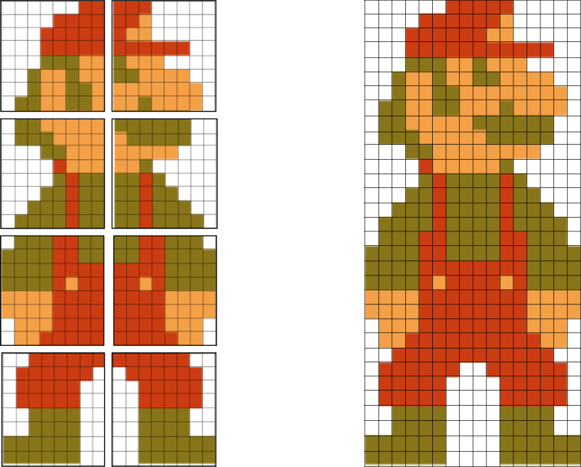
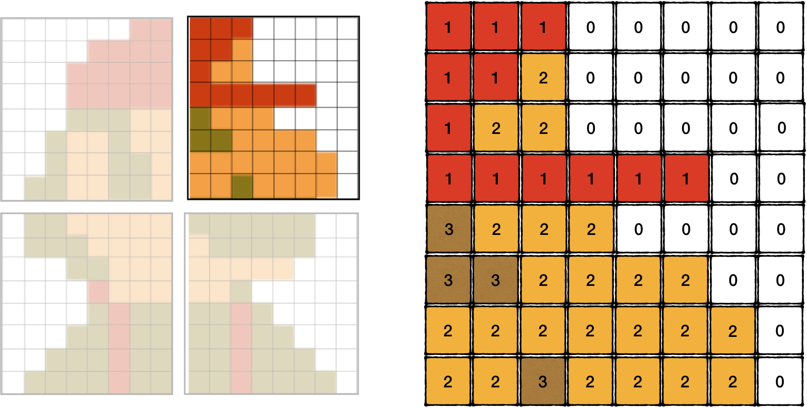
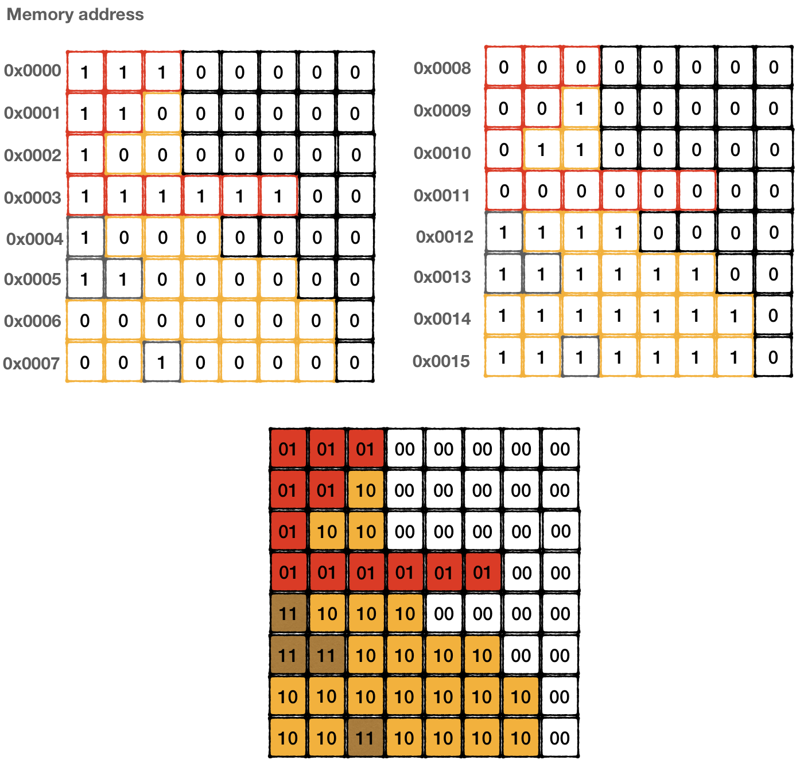
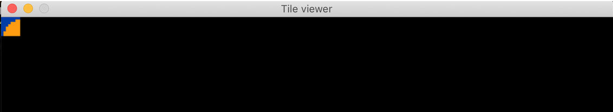
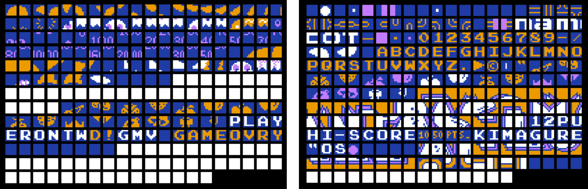

# Rendering CHR ROM Tiles

The address space **[0x0 .. 0x2000]** on PPU is reserved for CHR ROM - visual graphics data of a game. 

That's *8 KiB* worth of data. And that's all there was in the first versions of NES cartridges. 

Visual data is packed in so-called tiles: an 8 x 8 pixel image that could use up to 4 colors. (to be precise, background tile can have 4 colors, a sprite tile can have 3 colors, and 0b00 is used as an indication that a pixel should be transparent)

```bash
8 * 8 * 2 (2 bits to codify color) = 128 bits  = 16 bytes to codify a single tile
```

8 KiB / 128 bits = 512 tiles. I.e. each cartridge contained 512 tiles in total, divided into 2 pages/banks. The banks did not really have a name, historically they are called "left" and "right".


<div style="text-align:center"></div>

8 pixels x 8 pixels is a tiny size, not much can be presented that way. The majority of objects in NES games are composed of multiple tiles. 

 <div style="text-align:center"><br/> 8x8 pixel art by <a href="https://twitter.com/johanvinet">Johan Vinet</a> <br/><a href="https://twitter.com/PixelProspector/status/1097565152940044293">[Check it out]</a> </div>

What makes the CHR format tricky is that tiles themselves don't have color information. Each pixel in a tile is codified using 2 bits, declaring a color index in a palette, not a color itself.

> If NES were using popular RGB format for each pixel, a single tile would occupy  8*8*24 = 192 bytes. And it would require 96 KiB of CHR ROM space to hold 512 tiles. 

The real color of a pixel is decided during the rendering phase by using the so-called color palette, more on this later.

By reading just CHR ROM, it is impossible to derive colors, only shapes. 

<div style="text-align:center"></div>

<div style="text-align:center"></div>

Surprisingly, 2 bits of a pixel are not codified in the same byte. A tile is described using 16 bytes. And each row in is encoded using 2 bytes that stands 8 bytes apart from each other. 
To figure out the color index of the top-left pixel, we need to read the 7th bit of byte 0x0000 and the 7th bit of byte 0x0008, to get the next pixel in the same Row we would need to read 6th bits in the same bytes, etc..


<div style="text-align:center"></div>


## Pallette 

Before rendering CHR ROM content, we need to briefly discuss the colors available to the NES. 
Different versions of the PPU chip had slightly different system-level palettes of 52 hardwired colors. 

All necessary details can be found on corresponding [nesdev wiki page](http://wiki.nesdev.com/w/index.php/PPU_palettes#Palettes).


<div style="text-align:center"></div>

There are multiple variations used in emulators. Some make the picture more visually appealing, while others keep it closer to the original picture NES generated on a TV. 

It doesn't matter much which one we would choose, most of them get us good enough results.

However, we still need to codify that table in RGB format, that is recognized by SDL2 library:

```rust
#[rustfmt::skip]
 
pub static SYSTEM_PALLETE: [(u8,u8,u8); 64] = [
   (0x80, 0x80, 0x80), (0x00, 0x3D, 0xA6), (0x00, 0x12, 0xB0), (0x44, 0x00, 0x96), (0xA1, 0x00, 0x5E),
   (0xC7, 0x00, 0x28), (0xBA, 0x06, 0x00), (0x8C, 0x17, 0x00), (0x5C, 0x2F, 0x00), (0x10, 0x45, 0x00),
   (0x05, 0x4A, 0x00), (0x00, 0x47, 0x2E), (0x00, 0x41, 0x66), (0x00, 0x00, 0x00), (0x05, 0x05, 0x05),
   (0x05, 0x05, 0x05), (0xC7, 0xC7, 0xC7), (0x00, 0x77, 0xFF), (0x21, 0x55, 0xFF), (0x82, 0x37, 0xFA),
   (0xEB, 0x2F, 0xB5), (0xFF, 0x29, 0x50), (0xFF, 0x22, 0x00), (0xD6, 0x32, 0x00), (0xC4, 0x62, 0x00),
   (0x35, 0x80, 0x00), (0x05, 0x8F, 0x00), (0x00, 0x8A, 0x55), (0x00, 0x99, 0xCC), (0x21, 0x21, 0x21),
   (0x09, 0x09, 0x09), (0x09, 0x09, 0x09), (0xFF, 0xFF, 0xFF), (0x0F, 0xD7, 0xFF), (0x69, 0xA2, 0xFF),
   (0xD4, 0x80, 0xFF), (0xFF, 0x45, 0xF3), (0xFF, 0x61, 0x8B), (0xFF, 0x88, 0x33), (0xFF, 0x9C, 0x12),
   (0xFA, 0xBC, 0x20), (0x9F, 0xE3, 0x0E), (0x2B, 0xF0, 0x35), (0x0C, 0xF0, 0xA4), (0x05, 0xFB, 0xFF),
   (0x5E, 0x5E, 0x5E), (0x0D, 0x0D, 0x0D), (0x0D, 0x0D, 0x0D), (0xFF, 0xFF, 0xFF), (0xA6, 0xFC, 0xFF),
   (0xB3, 0xEC, 0xFF), (0xDA, 0xAB, 0xEB), (0xFF, 0xA8, 0xF9), (0xFF, 0xAB, 0xB3), (0xFF, 0xD2, 0xB0),
   (0xFF, 0xEF, 0xA6), (0xFF, 0xF7, 0x9C), (0xD7, 0xE8, 0x95), (0xA6, 0xED, 0xAF), (0xA2, 0xF2, 0xDA),
   (0x99, 0xFF, 0xFC), (0xDD, 0xDD, 0xDD), (0x11, 0x11, 0x11), (0x11, 0x11, 0x11)
];
 ```

 ## Rendering CHR Rom 

To render tiles from a CHR ROM, we need to get a ROM file of a game. 
Google would help you find a lot of ROM dumps of the well-known classics. However, downloading such ROMs if you don't have a cartridge would be illegal (wink-wink).
There is a site that listed legit homebrew games that were recently developed. And some of them are pretty good, most of them are free.
Check it out: [www.nesworld.com](http://www.nesworld.com/article.php?system=nes&data=neshomebrew)

The caveat here that our emulator supports only NES 1.0 format. And homebrew developed games tend to use NES 2.0. 
Games like "Alter Ego" would do. 

I would use Pacman, mostly because it's recognizable, and I happen to own a cartridge of this game. 

First, let's create an abstraction layer for a frame, so we wouldn't need to work with SDL directly:

```rust
pub struct Frame {
   pub data: Vec<u8>,
}
 
impl Frame {
   const WIDTH: usize = 256;
   const HIGHT: usize = 240;
 
   pub fn new() -> Self {
       Frame {
           data: vec![0; (Frame::WIDTH) * (Frame::HIGHT) * 3],
       }
   }
 
   pub fn set_pixel(&mut self, x: usize, y: usize, rgb: (u8, u8, u8)) {
       let base = y * 3 * Frame::WIDTH + x * 3;
       if base + 2 < self.data.len() {
           self.data[base] = rgb.0;
           self.data[base + 1] = rgb.1;
           self.data[base + 2] = rgb.2;
       }
   }
}
```


Now we are ready to render a tile on a frame:

```rust
fn show_tile(chr_rom: &Vec<u8>, bank: usize, tile_n: usize) ->Frame {
   assert!(bank <= 1);
 
   let mut frame = Frame::new();
   let bank = (bank * 0x1000) as usize;
  
   let tile = &chr_rom[(bank + tile_n * 16)..=(bank + tile_n * 16 + 15)];
 
   for y in 0..=7 {
       let mut upper = tile[y];
       let mut lower = tile[y + 8];
 
       for x in (0..=7).rev() {
           let value = (1 & upper) << 1 | (1 & lower);
           upper = upper >> 1;
           lower = lower >> 1;
           let rgb = match value {
               0 => palette::SYSTEM_PALLETE[0x01],
               1 => palette::SYSTEM_PALLETE[0x23],
               2 => palette::SYSTEM_PALLETE[0x27],
               3 => palette::SYSTEM_PALLETE[0x30],
               _ => panic!("can't be"),
           };
           frame.set_pixel(x, y, rgb)
       }
   }
 
   frame
}
```

> **Note:** for now, we're interpreting color indices randomly. Just pick 4 random colors from the system palette for each index value to see how it would look like.

Tying it all together in the main loop:

```rust
fn main() {
   // ….init sdl2
   // ....
 
   //load the game
   let bytes: Vec<u8> = std::fs::read("pacman.nes").unwrap();
   let rom = Rom::new(&bytes).unwrap();
 
   let tile_frame = show_tile(&rom.chr_rom, 1,0);
 
   texture.update(None, &tile_frame.data, 256 * 3).unwrap();
   canvas.copy(&texture, None, None).unwrap();
   canvas.present();
 
   loop {
      for event in event_pump.poll_iter() {
         match event {
           Event::Quit { .. }
           | Event::KeyDown {
               keycode: Some(Keycode::Escape),
               ..
           } => std::process::exit(0),
           _ => { /* do nothing */ }
         }
      }
 
   }
}
```

And the result is not that impressive: 

<div style="text-align:center"></div>

Might it be a Pacman's back..err.. head?  Who knows.

We can adjust code just a little bit to draw all tiles from CHR ROM:

<div style="text-align:center"></div>


Aha! Despite colors being clearly off, the shapes are recognizable now. Parts of ghosts, some letters, and numbers.
I guess that's it. Moving on


<br/>

------

> The full source code for this chapter: <a href="https://github.com/bugzmanov/nes_ebook/tree/master/code/ch6.3" target="_blank">GitHub</a>
