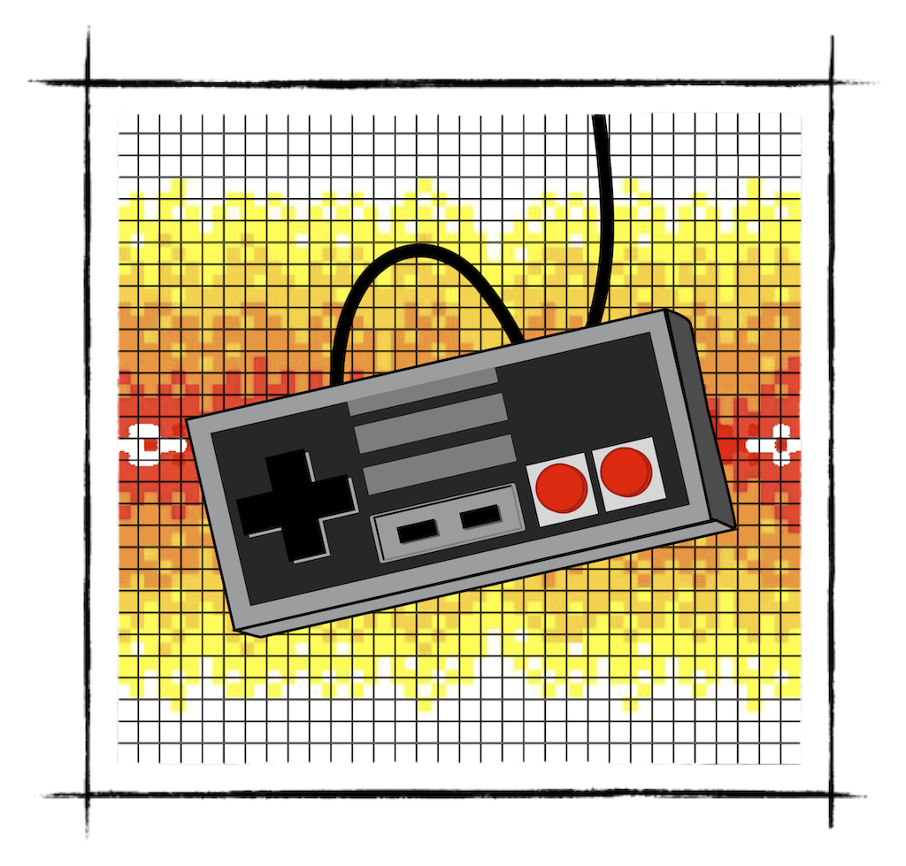
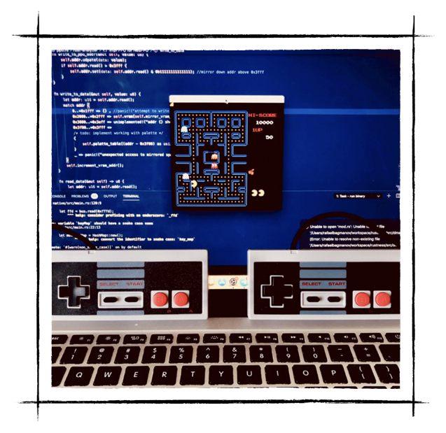
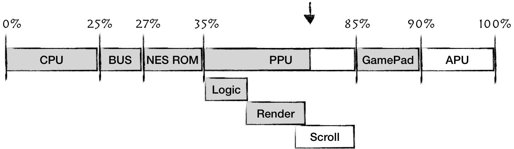

# Emulating joypads

NES and famicom supported variety of controllers:
- [Joypads](https://www.youtube.com/watch?v=UKMO5tlANEU)
- [power pads](https://www.youtube.com/watch?v=ErzuU78v60M)
- [Lightgun Zapper](https://www.youtube.com/watch?v=x6u3ek7BXps)
- [Arkanoid controller](https://www.youtube.com/watch?v=u9k6xoErR4w)
- [And even a keyboard](https://www.youtube.com/watch?v=j8J58aTxCPM)

We will emulate joypads as it's the easiest device to emulate
<div style="text-align:center;"></div>

Two joypads are mapped to 0x4016 and 0x4017 CPU address space respectively.
Same register can be used for both reading and writing. 
Reading from a controller reports the state of a button (1 - pressed, 0 - released). Controller reports 1 button at a time. To get the state of all buttons, the CPU has to read the controller register 8 times. 

The order of reported Buttons is as follows: 

```bash
A -> B -> Select -> Start -> Up -> Down -> Left -> Right
```

After reporting button **RIGHT***, controller would return 1s for any following read, until strobe mode change

The CPU can change the mode of a controller by writing a byte to the register, however only 1 bit is used. 

Controller operates in 2 modes:
- strobe bit on - controller reports only status of button A (1 - pressed, 0 - released) on each read request
- strobe bit off - controller cycles through all buttons, 1 at a time. 


So the most basic cycle to read state of a joypad for CPU:
1) Write 0x1 to 0x4016 (to reset pointer to button A)
2) Write 0x0 to 0x4016 (to turn off strobe bit)
3) Read 0x4016 from 8 times 
4) Repeat

Ok, so lets sketch it out. 

We would need 1 byte to store status of all buttons:

```rust
bitflags! {
       // https://wiki.nesdev.com/w/index.php/Controller_reading_code
       pub struct JoypadButton: u8 {
           const RIGHT             = 0b10000000;
           const LEFT              = 0b01000000;
           const DOWN              = 0b00100000;
           const UP                = 0b00010000;
           const START             = 0b00001000;
           const SELECT            = 0b00000100;
           const BUTTON_B          = 0b00000010;
           const BUTTON_A          = 0b00000001;
       }
}
```

Then all we need to track: strobe mode, status of all buttons and an index of a button to be reported on next read:

```rust
pub struct Joypad {
   strobe: bool,
   button_index: u8,
   button_status: JoypadButton,
}
 
impl Joypad {
   pub fn new() -> Self {
       Joypad {
           strobe: false,
           button_index: 0,
           button_status: JoypadButton::from_bits_truncate(0),
       }
   }
}
```

Then we can implement reading from and writing to a controller:

```rust
impl Joypad {
  //...
   pub fn write(&mut self, data: u8) {
       self.strobe = data & 1 == 1;
       if self.strobe {
           self.button_index = 0
       }
   }
 
   pub fn read(&mut self) -> u8 {
       if self.button_index > 7 {
           return 1;
       }
       let response = (self.button_status.bits & (1 << self.button_index)) >> self.button_index;
       if !self.strobe && self.button_index <= 7 {
           self.button_index += 1;
       }
       response
   }
}
```

Don't forget to connect the Joypad to the BUS and add maping for address 0x4016. 

One last step is to adjust our game loop to update the status of the joypad depending of a keyboard button being pressed or released:

```rust 
fn main() {
   //... init sdl2
   //... load the game
   let mut key_map = HashMap::new();
   key_map.insert(Keycode::Down, joypad::JoypadButton::DOWN);
   key_map.insert(Keycode::Up, joypad::JoypadButton::UP);
   key_map.insert(Keycode::Right, joypad::JoypadButton::RIGHT);
   key_map.insert(Keycode::Left, joypad::JoypadButton::LEFT);
   key_map.insert(Keycode::Space, joypad::JoypadButton::SELECT);
   key_map.insert(Keycode::Return, joypad::JoypadButton::START);
   key_map.insert(Keycode::A, joypad::JoypadButton::BUTTON_A);
   key_map.insert(Keycode::S, joypad::JoypadButton::BUTTON_B);
 
 
   // run the game cycle
   let bus = Bus::new(rom, move |ppu: &NesPPU, joypad: &mut joypad::Joypad| {
       render::render(ppu, &mut frame);
       texture.update(None, &frame.data, 256 * 3).unwrap();
 
       canvas.copy(&texture, None, None).unwrap();
 
       canvas.present();
       for event in event_pump.poll_iter() {
           match event {
               Event::Quit { .. }
               | Event::KeyDown {
                   keycode: Some(Keycode::Escape),
                   ..
               } => std::process::exit(0),
 
 
               Event::KeyDown { keycode, .. } => {
                   if let Some(key) = key_map.get(&keycode.unwrap_or(Keycode::Ampersand)) {
                       joypad.set_button_pressed_status(*key, true);
                   }
               }
               Event::KeyUp { keycode, .. } => {
                   if let Some(key) = key_map.get(&keycode.unwrap_or(Keycode::Ampersand)) {
                       joypad.set_button_pressed_status(*key, false);
                   }
               }
 
               _ => { /* do nothing */ }
           }
       }
   });
 
   //...
}
```

And here we are. Now we can play nes classics, using a keyboard. If you want to have a little bit more of geeky fun, I highly recommend buying USB replicas of original NES controllers on Amazon. 

SDL2 fully supports gamepads and with just a tiny adjustment in our game loop we can have almost perfect NES experience. 


<div style="text-align:center;"></div>

Ok, we've made quite a bit of a progress here. Two major pieces left out are: Support for scrolling - we will enable gaming into platformers. And Audio Processing Unit - to get those nice NES chiptunes back in our lives. 


<div style="text-align:center;"></div>
