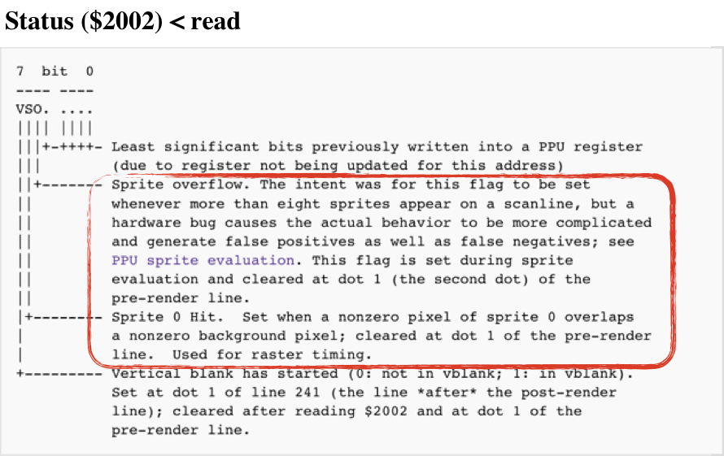
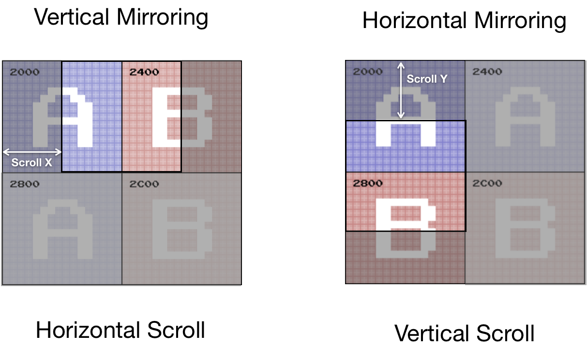
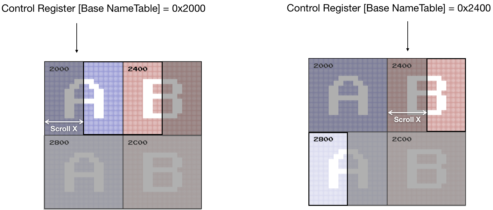
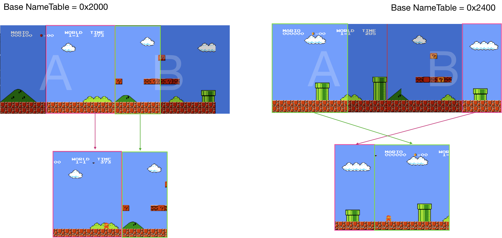

# PPU Scrolling

Before we start discussing scrolling, we need to clarify one detail. We've discussed that PPU notifies the state of the frame by triggering NMI interrupt, which tells CPU that rendering of the current frame is finished.
That's not the whole story. PPU has 2 additional mechanisms to tell its progress:
* [sprite zero hit flag](https://wiki.nesdev.com/w/index.php?title=PPU_OAM&redirect=no#Sprite_zero_hits)
* [sprite overflow flag](https://wiki.nesdev.com/w/index.php/PPU_sprite_evaluation#Sprite_overflow_bug)

Both are reported using [PPU status register **0x2002**](https://wiki.nesdev.com/w/index.php/PPU_registers#Status_.28.242002.29_.3C_read)

<div style="text-align:center;"></div>

Sprite overflow is rarely used because it had a bug that resulted in false positives and false negatives.
Sprite 0 hit though is used by the majority of games that have scrolling. <br/>It's the way to get mid-frame progress status
of PPU:
* put sprite zero on a specific screen location (X, Y)
* poll status register
* when sprite_zero_hit changes from 0 to 1 - CPU knows that PPU has finished rendering **[0 .. Y]** scanlines, and on the Y scanline, it's done rendering X pixels.

> This is a very rough simulation of the behavior. The accurate one requires checking opaque pixels of a sprite colliding with opaque pixels of background.

We need to codify this behavior in PPU `tick` function:

```rust
    pub fn tick(&mut self, cycles: u8) -> bool {
        self.cycles += cycles as usize;
        if self.cycles >= 341 {
            if self.is_sprite_0_hit(self.cycles) {
                self.status.set_sprite_zero_hit(true);
            }

            self.cycles = self.cycles - 341;
            self.scanline += 1;

            if self.scanline == 241 {
                self.status.set_vblank_status(true);
                self.status.set_sprite_zero_hit(false);
                if self.ctrl.generate_vblank_nmi() {
                    self.nmi_interrupt = Some(1);
                }
            }

            if self.scanline >= 262 {
                self.scanline = 0;
                self.nmi_interrupt = None;
                self.status.set_sprite_zero_hit(false);
                self.status.reset_vblank_status();
                return true;
            }
        }
        return false;
    }

    fn is_sprite_0_hit(&self, cycle: usize) -> bool {
        let y = self.oam_data[0] as usize;
        let x = self.oam_data[3] as usize;
        (y == self.scanline as usize) && x <= cycle && self.mask.show_sprites()
    }

```

Note: the sprite zero hit flag should be erased upon entering VBLANK state.


## Scrolling

The scroll is one of the primary mechanisms to simulate movement in space in NES games. It's an old idea of moving the viewport against the static background to create an illusion of movement through space.

<div style="text-align:center;"></div>

The scroll is implemented on the PPU level and only affects the rendering of background tiles (those stored in nametables). Sprites (OAM data) are not affected by this.

PPU can keep two screens in memory simultaneously (remember one name table - 1024 bytes, and PPU has 2 KiB of VRAM). This doesn't look like a lot, but this is enough to do the trick. During the scroll the viewport cycles through those two nametables, while the CPU is busy updating the part of the screen that's not yet visible, but will be soon.
That also means that most of the time, the PPU is rendering parts of both nametables.

Because this exhausts all available console resources, early games had only 2 options for scrolling: horizontal or vertical. Old games were settled on the type of scroll for the whole game.
Games that came later on had a mechanism to alternate scrolling between stages. And the most advanced games (like Zelda) provided the experience where a user can "move" in all 4 directions.

<div style="text-align:center;"></div>


Initially, the scroll was tightly coupled with mirroring - mostly because of the way NES handled overflow of a viewport from one nametable to another on hardware level.

For games like Super Mario Bros (Horizontal Scroll) or Ice Climber (Vertical Scroll), the mechanism is entirely defined by:
- Mirroring type (set in a cartridge ROM header)
- Base Nametable address (value in PPU Control register)
- Status of PPU Scroll Register (X and Y shift values of the viewport, in pixels)
- Content of Nametables

Remember, a background screen is defined by 960 tiles, each tile being 8x8 pixels, because PPU Scroll Register defines shifts in pixels, which means that on edges of the viewport, we can see parts of a tile.


<div style="text-align:center;"></div>


Updating PPU memory is relatively expensive, and the CPU can do this only during 241 - 262 scanlines. Because of these constraints, the CPU can update a relatively thin part (2x30 tiles wide area) of a screen per frame.
If we render parts of the nametables that are not yet visible, we can see how the state of the world comes into existence a couple frames before entering the viewport.

<div style="text-align:center;"></div>

2 last notes before jumping into implementation:
* The palette of a tile is defined by the nametable the tile belongs to, **not** by the base nametable specified in the Control register
* For horizontal scrolling the content of the base nametable always goes to the left part of the viewport (or top part in case of vertical scrolling)


<div style="text-align:center;"></div>

Implementing scroll rendering is not hard but requires attention to details. The most convenient mental model I could come up with is the following:
* For each frame, we would scan through both nametables.
* For each nametable we would specify visible part of the nametable:

```rust
struct Rect {
   x1: usize,
   y1: usize,
   x2: usize,
   y2: usize,
}

impl Rect {
   fn new(x1: usize, y1: usize, x2: usize, y2: usize) -> Self {
       Rect {
           x1: x1,
           y1: y1,
           x2: x2,
           y2: y2,
       }
   }
}
```

* And apply shift transformation for each visible pixel - shift_x, shift_y

> For example,
> <div style="text-align:center;"></div>
>
> For nametable **0x2400**: the visible area would be defined as **(200, 0, 256, 240)** and the shift would be **(-200, 0)**<br/>
> For nametable **0x2000**: the visible area is **(0,0, 200, 240)** and the shift is **(56, 0)**

So, to draw a nametable we need to create a helper function:

```rust
fn render_name_table(ppu: &NesPPU, frame: &mut Frame, name_table: &[u8],
   view_port: Rect, shift_x: isize, shift_y: isize) {
   let bank = ppu.ctrl.bknd_pattern_addr();

   let attribute_table = &name_table[0x3c0.. 0x400];

   for i in 0..0x3c0 {
       let tile_column = i % 32;
       let tile_row = i / 32;
       let tile_idx = name_table[i] as u16;
       let tile = &ppu.chr_rom[(bank + tile_idx * 16) as usize..=(bank + tile_idx * 16 + 15) as usize];
       let palette = bg_pallette(ppu, attribute_table, tile_column, tile_row);

       for y in 0..=7 {
           let mut upper = tile[y];
           let mut lower = tile[y + 8];

           for x in (0..=7).rev() {
               let value = (1 & lower) << 1 | (1 & upper);
               upper = upper >> 1;
               lower = lower >> 1;
               let rgb = match value {
                   0 => palette::SYSTEM_PALLETE[ppu.palette_table[0] as usize],
                   1 => palette::SYSTEM_PALLETE[palette[1] as usize],
                   2 => palette::SYSTEM_PALLETE[palette[2] as usize],
                   3 => palette::SYSTEM_PALLETE[palette[3] as usize],
                   _ => panic!("can't be"),
               };
               let pixel_x = tile_column * 8 + x;
               let pixel_y = tile_row * 8 + y;

               if pixel_x >= view_port.x1 && pixel_x < view_port.x2 && pixel_y >= view_port.y1 && pixel_y < view_port.y2 {
                   frame.set_pixel((shift_x + pixel_x as isize) as usize, (shift_y + pixel_y as isize) as usize, rgb);
               }
           }
       }
   }
}
```


Then rendering background becomes relatively simple:

```rust


pub fn render(ppu: &NesPPU, frame: &mut Frame) {
   let scroll_x = (ppu.scroll.scroll_x) as usize;
   let scroll_y = (ppu.scroll.scroll_y) as usize;

   let (main_nametable, second_nametable) = match (&ppu.mirroring, ppu.ctrl.nametable_addr()) {
       (Mirroring::Vertical, 0x2000) | (Mirroring::Vertical, 0x2800) => {
           (&ppu.vram[0..0x400], &ppu.vram[0x400..0x800])
       }
       (Mirroring::Vertical, 0x2400) | (Mirroring::Vertical, 0x2C00) => {
           ( &ppu.vram[0x400..0x800], &ppu.vram[0..0x400])
       }
       (_,_) => {
           panic!("Not supported mirroring type {:?}", ppu.mirroring);
       }
   };

   render_name_table(ppu, frame,
       main_nametable,
       Rect::new(scroll_x, scroll_y, 256, 240 ),
       -(scroll_x as isize), -(scroll_y as isize)
   );

    render_name_table(ppu, frame,
        second_nametable,
        Rect::new(0, 0, scroll_x, 240),
        (256 - scroll_x) as isize, 0
    );

// … render sprites
}

```

Implementing the vertical scroll is similar; we could reuse the same `render_name_table` helper function without changes. Just need to figure out proper *addressing*, *shifts*, and *view_port* parameters.

The fully defined code for scrolling can be found [here](https://github.com/bugzmanov/nes_ebook/tree/master/code/ch8)

Support for scrolling means that now we can play old platformers like Super Mario Bros and Ice Climber.

The final missing piece is APU.

<br/>

------

> The full source code for this chapter: <a href="https://github.com/bugzmanov/nes_ebook/tree/master/code/ch8" target="_blank">GitHub</a>
